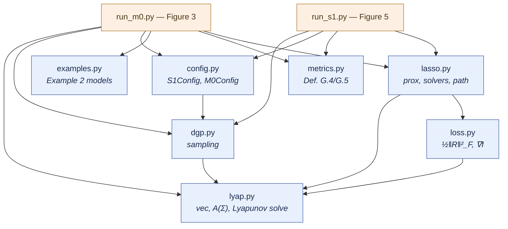
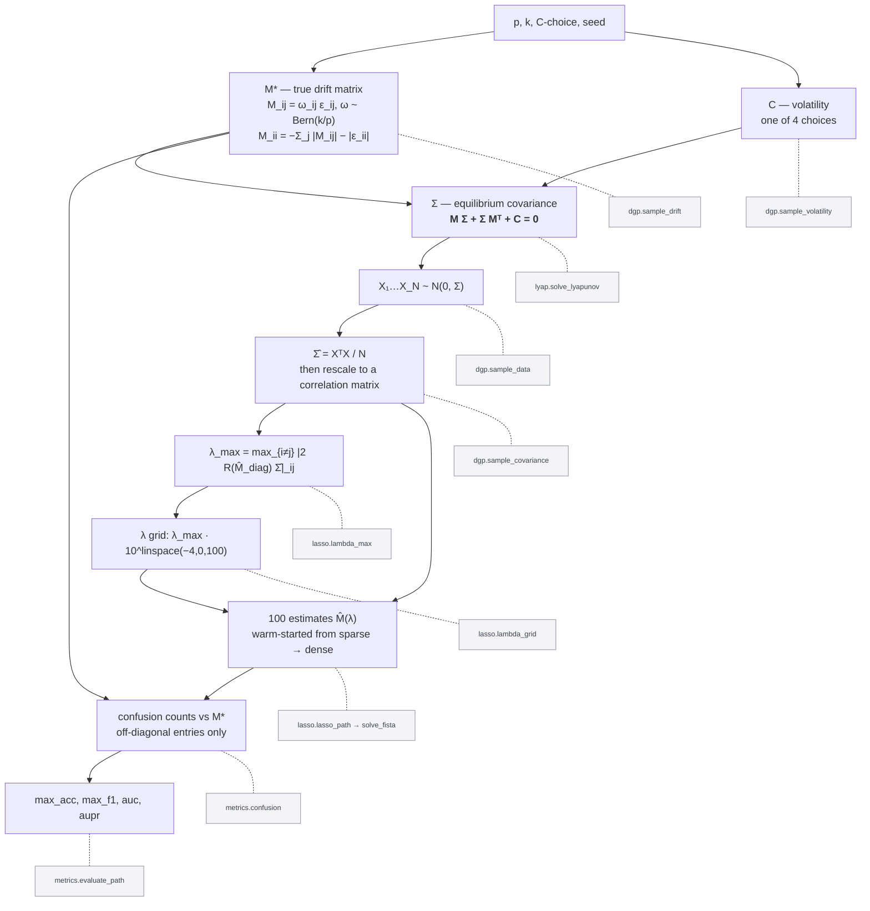
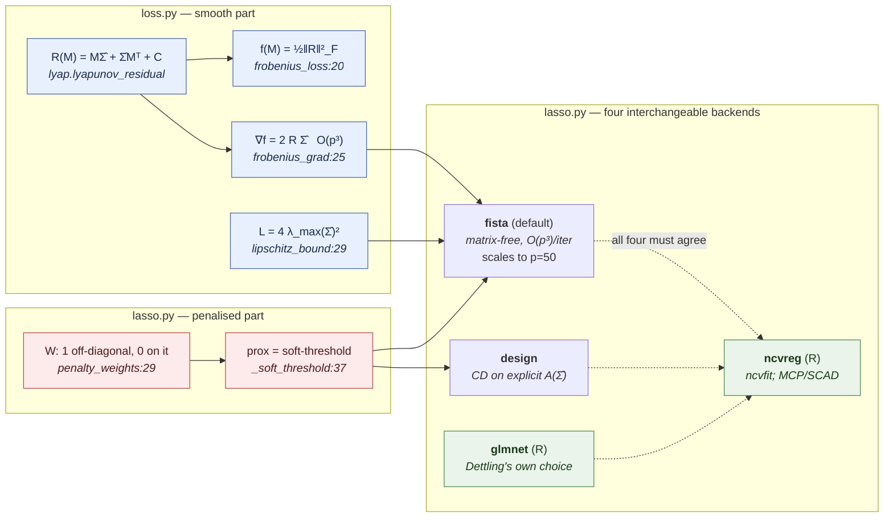
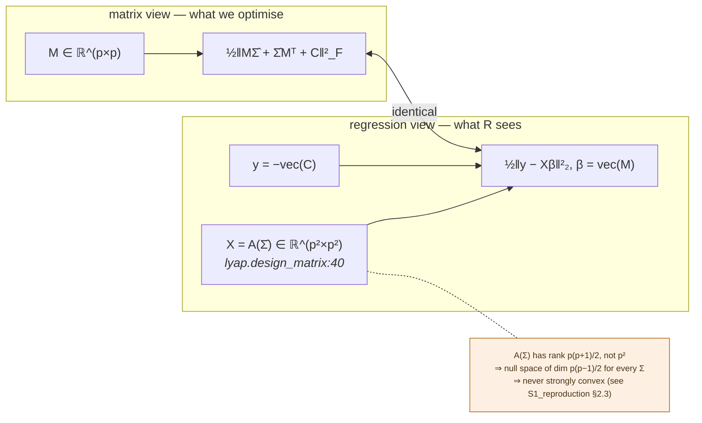
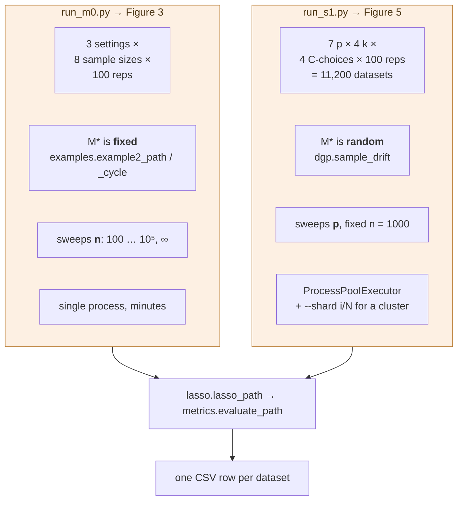
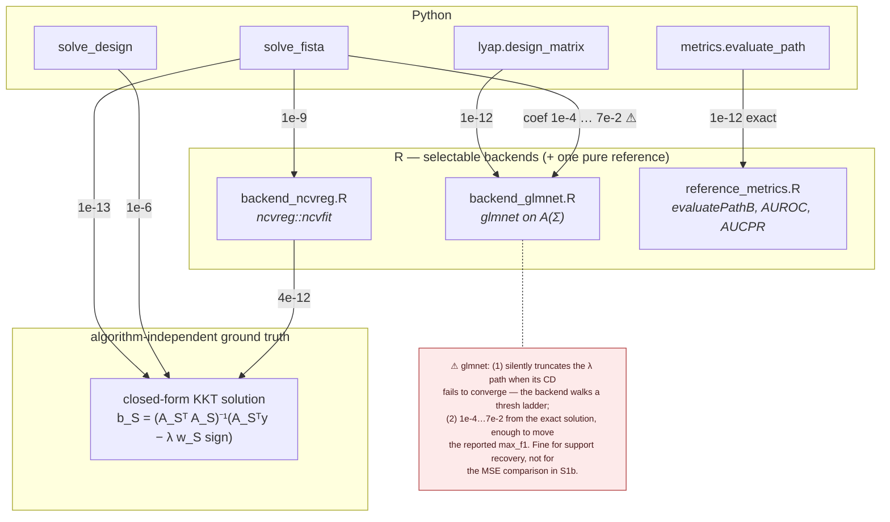

# Repository architecture

How the code that reproduces **Figure 3** and **Figure 5** of Dettling, Drton & Kolar (2024) is
organised, and how one number in those figures is actually produced.

Companion documents: [`simulations/S1_reproduction.md`](simulations/S1_reproduction.md) is the
*scientific* spec (model, settings, findings); [`R/ENCODING.md`](R/ENCODING.md) shows exactly how
the problem is encoded into the `glmnet` and `ncvreg` calls, with a worked example; this file is
the *code* map. The research plan is [`plan.md`](plan.md).

---

## 1. Layout

```
repo/
├── plan.md                        topic, references, meeting notes
├── README.md                      quick start
├── ARCHITECTURE.md                this file
│
├── src/gclm/                      the library — ~350 lines of logic
│   ├── lyap.py       (82)         vec/unvec, A(Σ), Γ(Σ), Lyapunov solve   ← no internal deps
│   ├── dgp.py       (115)         drift + volatility sampling, one replicate
│   ├── loss.py       (48)         ½‖R‖²_F and ∇f = 2RΣ          ← smooth half of the objective
│   ├── lasso.py     (~400)        penalty, prox, 4 backends, λ_max, path ← penalised half
│   ├── metrics.py   (128)         Definitions G.4/G.5, ROC/PR curves
│   ├── examples.py   (35)         the fixed 5-node models of Example 2
│   ├── rbridge.py    (67)         subprocess/JSON bridge to R; R stays optional
│   └── config.py     (58)         S1Config / M0Config — every knob in one place
│
├── simulations/
│   ├── S1_reproduction.md         spec, configs, findings (§8), status (§9)
│   ├── run_m0.py     (97)         ▶ Figure 3   — minutes
│   ├── run_s1.py    (114)         ▶ Figure 5   — ~7 h on 8 cores (measured)
│   └── results/                   committed run outputs backing §8
│
├── R/                             solver backends + metric reference
│   ├── ENCODING.md                how X and y map into the package calls, worked by hand
│   ├── backend_glmnet.R           Varando's lassoB(), i.e. glmnet on A(Σ) — Dettling's choice
│   ├── backend_ncvreg.R           ncvreg::ncvfit — most accurate, and MCP/SCAD for S1b
│   └── reference_metrics.R  (61)  Varando's evaluatePathB()/AUROC()/AUCPR() — validation only
│
└── tests/           (733)         77 tests; the `r` marker needs Rscript + glmnet
```

`R/` serves two roles. `backend_glmnet.R` and `backend_ncvreg.R` are **selectable production
solvers** (`--solver glmnet` / `--solver ncvreg`); `reference_metrics.R` is validation only. R
remains entirely optional: nothing imports `rbridge.py` unless an R backend is actually chosen, and
every R-backed test skips cleanly without `Rscript`.

---

## 2. Module dependencies

Strictly layered — no cycles, and `lyap.py` sits at the bottom with no internal imports.



`metrics.py` and `examples.py` are deliberately dependency-free: metrics take plain arrays, so they
can be tested against R without any of the estimation machinery being involved.

---

## 3. The pipeline for one dataset

Every number in either figure comes from one pass through this. The middle column is the
mathematical object; the right column is the function that produces it.



Two steps are worth pausing on.

**`solve_lyapunov` runs forwards, the estimator runs backwards.** The DGP goes `(M*, C) → Σ`; the
estimator goes `Σ̂ → M̂`. They are inverse directions through the same equation, which is what makes
the whole simulation a closed loop and makes `test_solve_lyapunov_residual` meaningful.

**Estimation always uses `C = 2·I`**, whatever `C` generated the data. That mismatch *is* Dettling's
misspecification experiment — it is why `C_Random_Full` scores worst — and it is one line in
`run_s1.py:42`.

---

## 4. Where the objective lives

The estimator is

$$\hat M(\lambda)=\arg\min_M\ \underbrace{\tfrac12\|M\hat\Sigma+\hat\Sigma M^\top+C\|_F^2}_{\text{loss.py}}\ +\ \underbrace{\lambda\|M\|_1}_{\text{lasso.py}}$$

and the split across two files is deliberate: **S1b (MCP/SCAD) changes only the right-hand box.**



Pick a backend with `lasso_path(..., solver=...)` or `run_s1.py --solver`. They minimize the same
objective; they differ in accuracy and cost (S1_reproduction.md §7.2). `ncvreg` is the most
accurate (4e-12 against the exact KKT solution) and the only one offering MCP/SCAD; `glmnet` is the
least accurate but is what Dettling used; `fista` is the only one that reaches the full grid.

`_soft_threshold` at `lasso.py:37` is, in its entirety, the ℓ₁ penalty. Replacing it with the MCP or
SCAD proximal operator is the whole of study S1b — nothing else in the diagram moves.

### The two equivalent views of the problem

`lyap.py` provides the bridge that makes `glmnet` comparison possible at all:



The matrix view costs `O(p³)` per iteration; the regression view costs `O(p⁴)` in memory but is the
only way to hand the problem to `glmnet`. Both are implemented, and `test_loss_matches_regression_form`
asserts they agree.

---

## 5. The two experiment drivers

Same library underneath; they differ only in where `M*` comes from and what is swept.



`n = ∞` in `run_m0.py` feeds the **population** Σ straight into the estimator, skipping sampling
entirely. That is what produces the exact `0.900 / 0.800 / 0.833` plateau for the 5-cycle — the
irrepresentability failure that no amount of data repairs, and the sharpest single check in the repo.

Seeding in `run_s1.py:36` is per task, `default_rng([seed, p, k, c_index, rep])`, so results do not
depend on worker count or scheduling order.

---

## 6. Validation architecture

Python is never checked only against itself.



The KKT solution is the important node: given the active set and signs, the optimum solves a linear
system, so it involves **no iterative solver at all**. That is what established that `glmnet` — not
our code — is the less accurate one at the dense end of the path, and later that `ncvfit` reaches
the same solution to 4e-12 in tens of iterations.

R is invoked from `pytest` via `tests/conftest.py`, passing JSON over a temp file. Every R-backed
test carries `@requires_r` and skips cleanly when `Rscript` is absent, so CI and the cluster need no
R installation.

---

## 7. Where to change what

| I want to… | file | notes |
|---|---|---|
| run MCP / SCAD today | — | `run_s1.py --solver ncvreg --penalty MCP` (already wired) |
| implement MCP / SCAD in Python | `lasso.py:37` | replace `_soft_threshold`; nothing else moves |
| choose a solver | `--solver`, or `S1Config.solver` | `fista` \| `design` \| `glmnet` \| `ncvreg` |
| change the p/k grid, tolerance, or a convention flag | `config.py` | every knob is here, not scattered in the drivers |
| add a metric | `metrics.py:103` | `evaluate_path` returns a dict; drivers just forward keys |
| change the DGP | `dgp.py:25`, `:55` | `sample_drift`, `sample_volatility` |
| run on a cluster | `run_s1.py` | `--shard i/N`; tasks are independent, one CSV row each |
| call R from Python | `rbridge.py` | JSON over subprocess; no rpy2, R stays optional |
| use the likelihood loss (S2) | new `loss` module | `lasso.py` only needs `grad` and a Lipschitz constant |

---

## 8. Test map

| test file | covers | R-backed |
|---|---|---|
| `test_lyap.py` | vec/commutation identities, `A(Σ)`, Lyapunov residual | 2 of 16 |
| `test_dgp.py` | every drawn `M` stable, every `C` ≻ 0, edge density, `n=∞` | 0 of 18 |
| `test_loss.py` | matrix vs. regression form, gradient vs. finite differences | 0 of 10 |
| `test_metrics.py` | Definitions G.4/G.5, curve construction, degenerate cases | 3 of 7 |
| `test_encoding.py` | the worked example in `R/ENCODING.md`: design matrix, λ conversions, fitted estimate | 2 of 9 |
| `test_lasso.py` | KKT optimality, **all four backends agree**, λ_max, rank deficiency, glmnet path truncation, MCP/SCAD plumbing, **Figure 3 population values** | 9 of 33 |

Run `pytest` for all 94, `pytest -m "not r"` to skip the R bridge.
