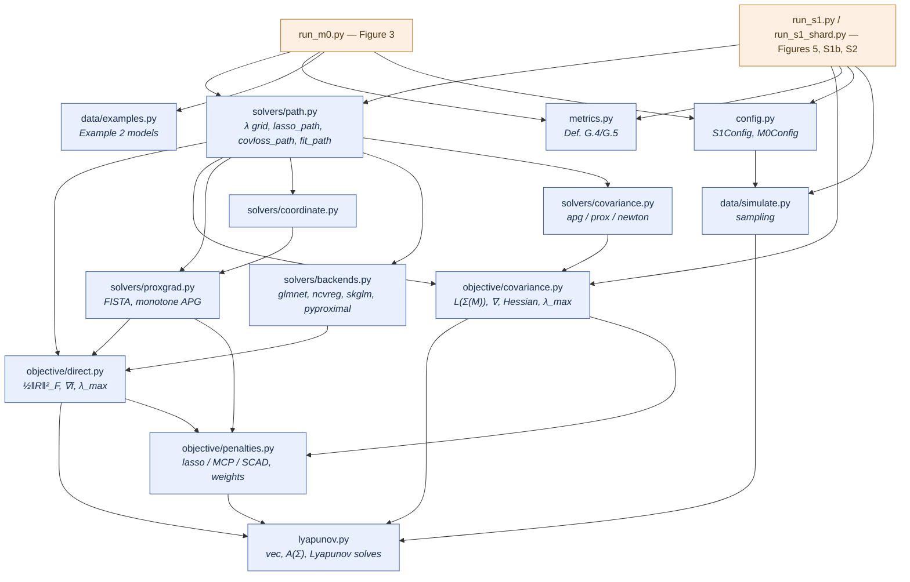
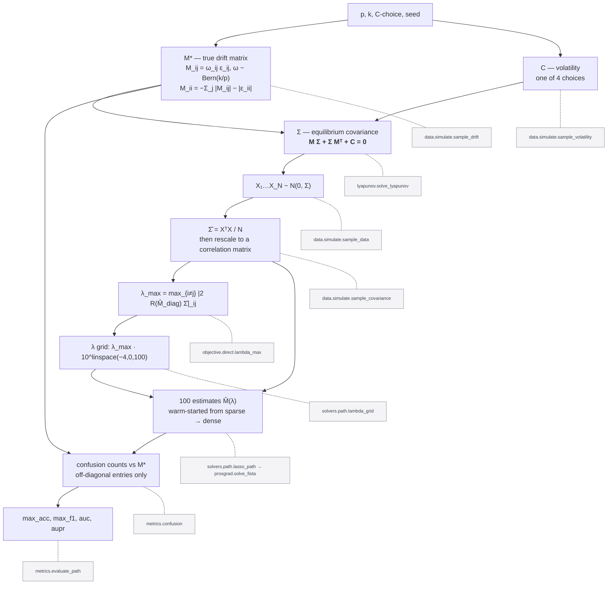
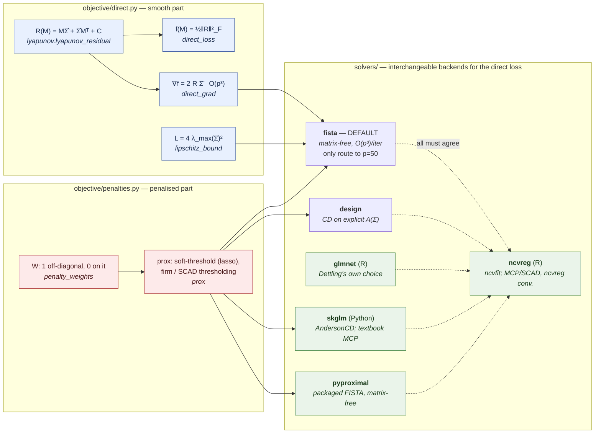
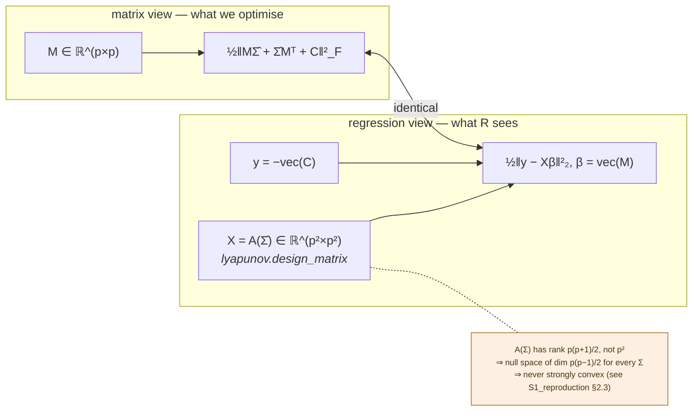
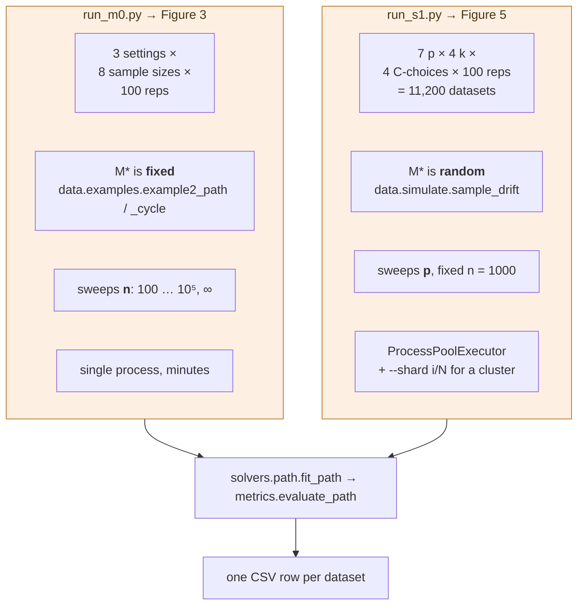
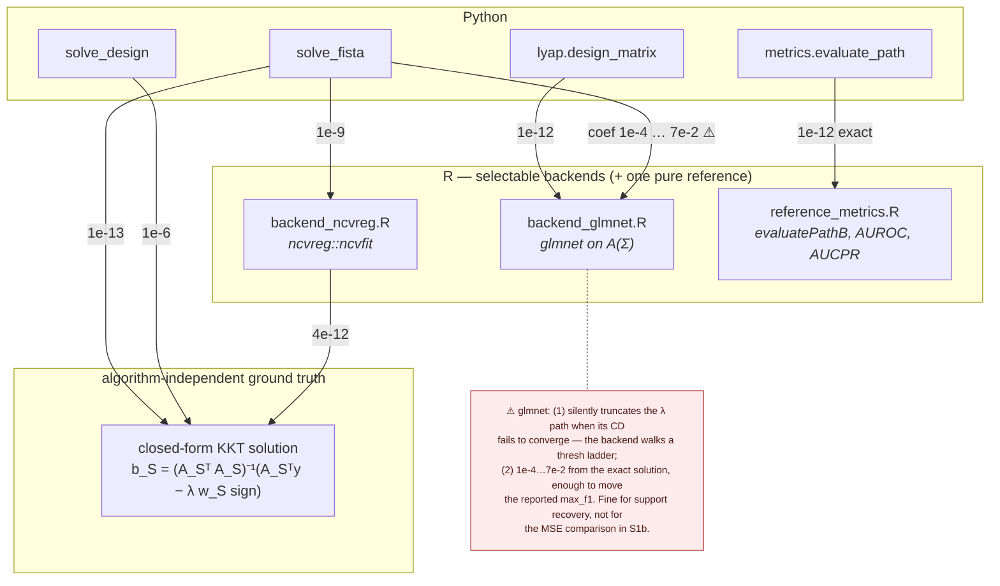

# Repository architecture

How the code that reproduces **Figure 3** and **Figure 5** of Dettling, Drton & Kolar (2024) is
organised, and how one number in those figures is actually produced.

Companion documents: [`simulations/S1_reproduction.md`](simulations/S1_reproduction.md) is the
*scientific* spec (model, settings, findings); [`docs/FISTA.md`](docs/FISTA.md) covers the default
solver and the package survey behind it; [`R/ENCODING.md`](R/ENCODING.md) shows exactly how
the problem is encoded into the `glmnet` and `ncvreg` calls, with a worked example; this file is
the *code* map. The research plan is [`plan.md`](plan.md).

---

## 1. Layout

```
repo/
├── plan.md                        topic, references, meeting notes
├── next_steps/                    dated memos: where the results stand, literature, remedies, plan
├── README.md                      quick start
├── ARCHITECTURE.md                this file
│
├── src/gclm/                      the library, one subpackage per concern
│   ├── lyapunov.py                the model: vec/unvec, A(Σ), Γ(Σ), Lyapunov solves incl. the
│   │                              Schur-based solver        ← no internal deps
│   ├── data/
│   │   ├── simulate.py            drift + volatility sampling, one replicate
│   │   └── examples.py            the fixed 5-node models of Example 2
│   ├── objective/
│   │   ├── direct.py              Dettling's loss ½‖R‖²_F, ∇f = 2RΣ, Lipschitz bound,
│   │   │                          diagonal fit, λ_max, penalised objective
│   │   ├── covariance.py          Varando's losses on Σ(M): loglik / Frobenius, gradient,
│   │   │                          Hessian, diagonal + dense fits, λ_max   (docs/LIKELIHOOD.md)
│   │   └── penalties.py           lasso / MCP / SCAD: values, proxes, stationarity, weights,
│   │                              the textbook / ncvreg conventions
│   ├── solvers/
│   │   ├── proxgrad.py            FISTA with restart (lasso), monotone APG (MCP/SCAD) — default
│   │   ├── coordinate.py          coordinate descent on the explicit design (reference)
│   │   ├── backends.py            glmnet / ncvreg (R), skglm / pyproximal (Python), λ conversions
│   │   ├── covariance.py          APG (the estimator) / proximal (reference) / Newton (experiment only)
│   │   └── path.py                λ grid, warm-started paths: lasso_path, covloss_path, fit_path
│   ├── metrics.py                 Definitions G.4/G.5, ROC/PR curves
│   ├── rbridge.py                 subprocess/JSON bridge to R; R stays optional
│   └── config.py                  S1Config / M0Config — every knob in one place
│
├── simulations/
│   ├── S1_reproduction.md         spec, configs, findings (§8), status (§9)
│   ├── run_m0.py                  ▶ Figure 3   — minutes
│   ├── run_s1.py                  ▶ Figure 5   — local, multiprocessing
│   ├── run_s1_shard.py            ▶ Figure 5   — one cluster shard -> rich .npz
│   ├── aggregate_s1.py            shards -> s1_per_dataset / _summary / _curves
│   ├── plot_figures.py            CSVs -> figures  (LOCAL ONLY, never on the cluster)
│   ├── plot_penalties.py          overlay several runs: penalties / losses vs. p  (LOCAL)
│   ├── S2_penalties_losses.md     S1b + S2: MCP/SCAD on the direct loss, and all three
│   │                              penalties on Varando's losses — setup, pilot results
│   └── results/                   committed run outputs backing §8
│
├── docs/
│   ├── FISTA.md                   solve_fista: algorithm, references, package survey
│   ├── NONCONVEX.md               MCP / SCAD: definitions, conventions, algorithm, tests
│   ├── LIKELIHOOD.md              Varando's losses: gradient, Hessian, Newton solver, the
│   │                              flat valley, multiple stationary points, gclm validation
│   └── REPRODUCTION.md            cluster recipe: what runs where, what comes back
│
├── runs/                          one folder per run: shards (gitignored), CSVs, figures
│   └── s1_dettling_reproduction/  full Figures 3 + 5 from the cluster
│
├── cluster/                       LRZ SLURM job scripts
│   ├── setup_env.sh               one-time venv setup on a login node
│   ├── s1_array.sbatch            Figure 5, 64-task array on serial_std
│   ├── submit_nsweep.sh           n-sweep at p = 10, 20: one array per (loss, penalty, n)
│   └── m0.sbatch                  Figure 3, single serial job
│
├── R/                             solver backends + metric reference
│   ├── ENCODING.md                how X and y map into the package calls, worked by hand
│   ├── backend_glmnet.R           Varando's lassoB(), i.e. glmnet on A(Σ) — Dettling's choice
│   ├── backend_ncvreg.R           ncvreg::ncvfit — lasso, and MCP/SCAD (ncvreg convention)
│   ├── backend_gclm.R             gclm::gclm — Varando's Algorithm 1; validation reference only
│   └── reference_metrics.R  (61)  Varando's evaluatePathB()/AUROC()/AUCPR() — validation only
│
└── tests/           (733)         77 tests; the `r` marker needs Rscript + glmnet
```

`R/` serves two roles. `backend_glmnet.R` and `backend_ncvreg.R` are **selectable production
solvers** (`--solver glmnet` / `--solver ncvreg`); `reference_metrics.R` is validation only. R
remains entirely optional: nothing imports `rbridge.py` unless an R backend is actually chosen, and
every R-backed test skips cleanly without `Rscript`.

---

## 2. Module dependencies

Strictly layered — no cycles, and `lyapunov.py` sits at the bottom with no internal imports. Within
the library the direction is always `solvers → objective → lyapunov`; the drivers sit on top.


```mermaid
graph TD
    lyap["lyapunov.py<br/><i>vec, A(Σ), Lyapunov solves</i>"]
    simulate["data/simulate.py<br/><i>sampling</i>"]
    examples["data/examples.py<br/><i>Example 2 models</i>"]
    penalties["objective/penalties.py<br/><i>lasso / MCP / SCAD, weights</i>"]
    direct["objective/direct.py<br/><i>½‖R‖²_F, ∇f, λ_max</i>"]
    covariance["objective/covariance.py<br/><i>L(Σ(M)), ∇, Hessian, λ_max</i>"]
    proxgrad["solvers/proxgrad.py<br/><i>FISTA, monotone APG</i>"]
    coordinate["solvers/coordinate.py"]
    backends["solvers/backends.py<br/><i>glmnet, ncvreg, skglm, pyproximal</i>"]
    covsolve["solvers/covariance.py<br/><i>apg / prox / newton</i>"]
    path["solvers/path.py<br/><i>λ grid, lasso_path, covloss_path, fit_path</i>"]
    metrics["metrics.py<br/><i>Def. G.4/G.5</i>"]
    config["config.py<br/><i>S1Config, M0Config</i>"]

    penalties --> lyap
    direct --> lyap
    direct --> penalties
    covariance --> lyap
    covariance --> penalties
    simulate --> lyap
    config --> simulate
    proxgrad --> direct
    proxgrad --> penalties
    coordinate --> proxgrad
    backends --> direct
    covsolve --> covariance
    path --> direct
    path --> covariance
    path --> proxgrad
    path --> coordinate
    path --> backends
    path --> covsolve

    m0["run_m0.py — Figure 3"]
    s1["run_s1.py / run_s1_shard.py — Figures 5, S1b, S2"]
    m0 --> path
    m0 --> metrics
    m0 --> examples
    m0 --> config
    s1 --> path
    s1 --> covariance
    s1 --> metrics
    s1 --> config
    s1 --> simulate

    classDef core fill:#e8f0fe,stroke:#4864a8,color:#1a2b4a
    classDef driver fill:#fdf0e3,stroke:#b5762a,color:#4a3413
    class lyap,simulate,examples,penalties,direct,covariance,proxgrad,coordinate,backends,covsolve,path,metrics,config core
    class m0,s1 driver
```

`metrics.py` and `data/examples.py` are deliberately dependency-free: metrics take plain arrays, so
they can be tested against R without any of the estimation machinery being involved. The
`objective/` modules know nothing about optimisation; each loss carries its own closed forms for the
sparse end of the path (`diagonal_fit`, `lambda_max`), because they differ between losses, and only
the λ grid is shared (`solvers/path.py`).

---

## 3. The pipeline for one dataset

Every number in either figure comes from one pass through this. The middle column is the
mathematical object; the right column is the function that produces it.


```mermaid
flowchart TD
    A["p, k, C-choice, seed"] --> B["M* — true drift matrix<br/>M_ij = ω_ij ε_ij, ω ~ Bern(k/p)<br/>M_ii = −Σ_j |M_ij| − |ε_ii|"]
    A --> C["C — volatility<br/>one of 4 choices"]
    B --> D["Σ — equilibrium covariance<br/><b>M Σ + Σ Mᵀ + C = 0</b>"]
    C --> D
    D --> E["X₁…X_N ~ N(0, Σ)"]
    E --> F["Σ̂ = XᵀX / N<br/>then rescale to a correlation matrix"]
    F --> G["λ_max = max_{i≠j} |2 R(M̂_diag) Σ̂|_ij"]
    G --> H["λ grid: λ_max · 10^linspace(−4,0,100)"]
    H --> I["100 estimates M̂(λ)<br/>warm-started from sparse → dense"]
    F --> I
    I --> J["confusion counts vs M*<br/>off-diagonal entries only"]
    B --> J
    J --> K["max_acc, max_f1, auc, aupr"]

    B -.- b1["data.simulate.sample_drift"]
    C -.- c1["data.simulate.sample_volatility"]
    D -.- d1["lyapunov.solve_lyapunov"]
    E -.- e1["data.simulate.sample_data"]
    F -.- f1["data.simulate.sample_covariance"]
    G -.- g1["objective.direct.lambda_max"]
    H -.- h1["solvers.path.lambda_grid"]
    I -.- i1["solvers.path.lasso_path → proxgrad.solve_fista"]
    J -.- j1["metrics.confusion"]
    K -.- k1["metrics.evaluate_path"]

    classDef fn fill:#f4f4f6,stroke:#9aa0ab,color:#3c4350,font-size:11px
    class b1,c1,d1,e1,f1,g1,h1,i1,j1,k1 fn
```

Two steps are worth pausing on.

**`solve_lyapunov` runs forwards, the estimator runs backwards.** The DGP goes `(M*, C) → Σ`; the
estimator goes `Σ̂ → M̂`. They are inverse directions through the same equation, which is what makes
the whole simulation a closed loop and makes `test_solve_lyapunov_residual` meaningful.

**Estimation always uses `C = 2·I`**, whatever `C` generated the data. That mismatch *is* Dettling's
misspecification experiment — it is why `C_Random_Full` scores worst — and it is one line in
`run_s1.py` (`c_est = 2.0 * np.eye(p)`).

---

## 4. Where the objective lives

The estimator is

$$\hat M(\lambda)=\arg\min_M\ \underbrace{\tfrac12\|M\hat\Sigma+\hat\Sigma M^\top+C\|_F^2}_{\text{objective/direct.py}}\ +\ \underbrace{\lambda\|M\|_1}_{\text{objective/penalties.py}}$$

and the split is deliberate: **S1b (MCP/SCAD) leaves the left-hand box untouched.** On the right it
swaps the proximal operator (`objective/penalties.py`) and, because plain FISTA carries no
convergence guarantee once the penalty is nonconvex, the iteration too (`solvers/proxgrad.py:_solve_mapg`,
docs/NONCONVEX.md §4). **S2 swaps the left-hand box** for one of Varando's losses on the implied
covariance (`objective/covariance.py`), which needs a solver family of its own
(`solvers/covariance.py`, docs/LIKELIHOOD.md) because those losses are nonconvex and nearly flat
along $p(p-1)/2$ directions.


```mermaid
flowchart LR
    subgraph smooth["objective/direct.py — smooth part"]
        R["R(M) = MΣ̂ + Σ̂Mᵀ + C<br/><i>lyapunov.lyapunov_residual</i>"]
        F["f(M) = ½‖R‖²_F<br/><i>direct_loss</i>"]
        G["∇f = 2 R Σ̂ &nbsp;&nbsp;O(p³)<br/><i>direct_grad</i>"]
        L["L = 4 λ_max(Σ̂)²<br/><i>lipschitz_bound</i>"]
        R --> F
        R --> G
    end
    subgraph pen["objective/penalties.py — penalised part"]
        W["W: 1 off-diagonal, 0 on it<br/><i>penalty_weights</i>"]
        P["prox: soft-threshold (lasso),<br/>firm / SCAD thresholding<br/><i>prox</i>"]
        W --> P
    end
    subgraph solve["solvers/ — interchangeable backends for the direct loss"]
        FI["<b>fista</b> — DEFAULT<br/><i>matrix-free, O(p³)/iter</i><br/>only route to p=50"]
        DE["<b>design</b><br/><i>CD on explicit A(Σ̂)</i>"]
        GL["<b>glmnet</b> (R)<br/><i>Dettling's own choice</i>"]
        NC["<b>ncvreg</b> (R)<br/><i>ncvfit; MCP/SCAD, ncvreg conv.</i>"]
        SK["<b>skglm</b> (Python)<br/><i>AndersonCD; textbook MCP</i>"]
        PX["<b>pyproximal</b><br/><i>packaged FISTA, matrix-free</i>"]
    end
    G --> FI
    L --> FI
    P --> FI
    P --> DE
    P --> SK
    FI -.->|"all must agree"| NC
    DE -.-> NC
    GL -.-> NC
    SK -.-> NC
    P --> PX
    PX -.-> NC

    classDef s fill:#e8f0fe,stroke:#4864a8,color:#1a2b4a
    classDef p fill:#fdeaea,stroke:#b5484a,color:#4a1a1b
    classDef rb fill:#eaf4ea,stroke:#4a8a4a,color:#1a3a1a
    class R,F,G,L s
    class W,P p
    class GL,NC,SK,PX rb
```

Pick a backend with `lasso_path(..., solver=...)` or `run_s1.py --solver`. They minimize the same
objective; they differ in accuracy and cost (S1_reproduction.md §7.2, and `docs/FISTA.md` for why
`fista` is hand-written rather than taken from a package). `ncvreg` is the most accurate (4e-12
against the exact KKT solution) and the only one with SCAD; `skglm` gives MCP without an R
dependency; `glmnet` is the least accurate but is what Dettling used; `fista` is the default and the only one
that reaches the full grid.

For the lasso, soft-thresholding is, in its entirety, the penalty. MCP and SCAD live in
`objective/penalties.py` and change two things: the proximal operator, and — because plain FISTA has no
convergence guarantee with a nonconvex penalty — the iteration, replaced by Li & Lin's monotone
APG. The loss and everything left of it stay unchanged. There are two ways to apply MCP/SCAD
(`convention="textbook"` or `"ncvreg"`), and only `fista` solves both; see
[`docs/NONCONVEX.md`](docs/NONCONVEX.md) §2.

### The two equivalent views of the problem

`lyapunov.py` provides the bridge that makes `glmnet` comparison possible at all:


```mermaid
flowchart LR
    subgraph mat["matrix view — what we optimise"]
        M1["M ∈ ℝ^(p×p)"]
        L1["½‖MΣ̂ + Σ̂Mᵀ + C‖²_F"]
        M1 --> L1
    end
    subgraph reg["regression view — what R sees"]
        X["X = A(Σ̂) ∈ ℝ^(p²×p²)<br/><i>lyapunov.design_matrix</i>"]
        Y["y = −vec(C)"]
        L2["½‖y − Xβ‖²₂, β = vec(M)"]
        X --> L2
        Y --> L2
    end
    L1 <-->|"identical"| L2

    note["A(Σ) has rank p(p+1)/2, not p²<br/>⇒ null space of dim p(p−1)/2 for every Σ<br/>⇒ never strongly convex (see S1_reproduction §2.3)"]
    X -.- note

    classDef n fill:#fdf0e3,stroke:#b5762a,color:#4a3413,font-size:11px
    class note n
```

The matrix view costs `O(p³)` per iteration; the regression view costs `O(p⁴)` in memory but is the
only way to hand the problem to `glmnet`. Both are implemented, and `test_loss_matches_regression_form`
asserts they agree.

---

## 5. The two experiment drivers

Same library underneath; they differ only in where `M*` comes from and what is swept.


```mermaid
flowchart TD
    subgraph m0["run_m0.py → Figure 3"]
        A1["3 settings ×<br/>8 sample sizes ×<br/>100 reps"]
        A2["M* is <b>fixed</b><br/>data.examples.example2_path / _cycle"]
        A3["sweeps <b>n</b>: 100 … 10⁵, ∞"]
        A4["single process, minutes"]
    end
    subgraph s1["run_s1.py → Figure 5"]
        B1["7 p × 4 k ×<br/>4 C-choices × 100 reps<br/>= 11,200 datasets"]
        B2["M* is <b>random</b><br/>data.simulate.sample_drift"]
        B3["sweeps <b>p</b>, fixed n = 1000"]
        B4["ProcessPoolExecutor<br/>+ --shard i/N for a cluster"]
    end
    core["solvers.path.fit_path → metrics.evaluate_path"]
    m0 --> core
    s1 --> core
    core --> out["one CSV row per dataset"]

    classDef d fill:#fdf0e3,stroke:#b5762a,color:#4a3413
    class m0,s1 d
```

`n = ∞` in `run_m0.py` feeds the **population** Σ straight into the estimator, skipping sampling
entirely. That is what produces the exact `0.900 / 0.800 / 0.833` plateau for the 5-cycle — the
irrepresentability failure that no amount of data repairs, and the sharpest single check in the repo.

Seeding in `run_s1.py:36` is per task, `default_rng([seed, p, k, c_index, rep])`, so results do not
depend on worker count or scheduling order.

---

## 6. Validation architecture

Python is never checked only against itself.


```mermaid
flowchart TD
    subgraph py["Python"]
        P1["lyap.design_matrix"]
        P2["solve_fista"]
        P3["solve_design"]
        P4["metrics.evaluate_path"]
    end
    subgraph gt["algorithm-independent ground truth"]
        K["closed-form KKT solution<br/>b_S = (A_Sᵀ A_S)⁻¹(A_Sᵀy − λ w_S sign)"]
    end
    subgraph r["R — selectable backends (+ one pure reference)"]
        R1["backend_glmnet.R<br/><i>glmnet on A(Σ)</i>"]
        R3["backend_ncvreg.R<br/><i>ncvreg::ncvfit</i>"]
        R2["reference_metrics.R<br/><i>evaluatePathB, AUROC, AUCPR</i>"]
    end
    P1 -->|"1e-12"| R1
    P2 -->|"1e-13"| K
    P3 -->|"1e-6"| K
    P2 -->|"1e-9"| R3
    R3 -->|"4e-12"| K
    P2 -->|"coef 1e-4 … 7e-2 ⚠"| R1
    P4 -->|"1e-12 exact"| R2

    w["⚠ glmnet: (1) silently truncates the λ path when its CD<br/>fails to converge — the backend walks a thresh ladder;<br/>(2) 1e-4…7e-2 from the exact solution, enough to move<br/>the reported max_f1. Fine for support recovery, not for<br/>the MSE comparison in S1b."]
    R1 -.- w

    classDef warn fill:#fdeaea,stroke:#b5484a,color:#4a1a1b,font-size:11px
    class w warn
```

The KKT solution is the important node: given the active set and signs, the optimum solves a linear
system, so it involves **no iterative solver at all**. That is what established that `glmnet` — not
our code — is the less accurate one at the dense end of the path, and later that `ncvfit` reaches
the same solution to 4e-12 in tens of iterations.

R is invoked from `pytest` via `tests/conftest.py`, passing JSON over a temp file. Every R-backed
test carries `@requires_r` and skips cleanly when `Rscript` is absent, so CI and the cluster need no
R installation.

---

## 7. Where to change what

| I want to… | file | notes |
|---|---|---|
| run MCP / SCAD | — | `--penalty MCP\|SCAD` (fista); `--solver skglm` (textbook MCP); `--solver ncvreg --convention ncvreg` |
| change a penalty or add one | `objective/penalties.py` | value, derivative, prox, stationarity; both solver families are generic in the penalty |
| choose a solver | `--solver`, or `S1Config.solver` | `fista` (default) \| `ncvreg` \| `skglm` \| `glmnet` \| `pyproximal` \| `design` |
| change the p/k grid, tolerance, or a convention flag | `config.py` | every knob is here, not scattered in the drivers |
| add a metric | `metrics.py` | `evaluate_path` returns a dict; drivers just forward keys |
| change the DGP | `data/simulate.py` | `sample_drift`, `sample_volatility` |
| run on a cluster | `run_s1.py` | `--shard i/N`; tasks are independent, one CSV row each |
| call R from Python | `rbridge.py` | JSON over subprocess; no rpy2, R stays optional |
| use the likelihood or Frobenius loss (S2) | `--loss loglik\|frobenius` | `objective/covariance.py` + `solvers/covariance.py` (docs/LIKELIHOOD.md); `--solver` is ignored |
| change how the covariance losses are solved | `solvers/covariance.py:solve` | `method`, `tol`, `newton_after`; `covloss_path` adds `direction` |
| add a loss | `objective/<name>.py` + a solver | value, gradient, `diagonal_fit`, `lambda_max`; then a branch in `solvers/path.py:fit_path` |

---

## 8. Test map

| test file | covers | R-backed |
|---|---|---|
| `test_lyap.py` | `lyapunov.py`: vec/commutation identities, `A(Σ)`, Lyapunov residual | 2 of 16 |
| `test_dgp.py` | `data/simulate.py`: every drawn `M` stable, every `C` ≻ 0, edge density, `n=∞` | 0 of 18 |
| `test_loss.py` | `objective/direct.py`: matrix vs. regression form, gradient vs. finite differences | 0 of 10 |
| `test_metrics.py` | Definitions G.4/G.5, curve construction, degenerate cases | 3 of 7 |
| `test_nonconvex.py` | MCP/SCAD: values, proxes vs brute force/skglm/pyproximal, what ncvfit minimises, solver, backends, bias removal | 6 of 83 |
| `test_fista.py` | the default solver: analytic solution, duality gap, cvxpy/CLARABEL, invariances, convergence rate | 0 of 22 |
| `test_encoding.py` | the worked example in `R/ENCODING.md`: design matrix, λ conversions, fitted estimate | 2 of 9 |
| `test_lasso.py` | KKT optimality, **all four backends agree**, λ_max, rank deficiency, glmnet path truncation, MCP/SCAD plumbing, **Figure 3 population values** | 9 of 33 |
| `test_covloss.py` | `objective/covariance.py` + `solvers/covariance.py` — Varando's losses: Schur Lyapunov solves, gradient and Hessian vs finite differences, Prop. 3.1, the two path ends, λ_max, both solvers reach stationary points, scaling identity, MCP→lasso limit, **gclm package** (objective scale, fixed points, same-basin agreement), paths | 6 of 63 |

Run `pytest` for all 274, `pytest -m "not r"` to skip the R bridge.
