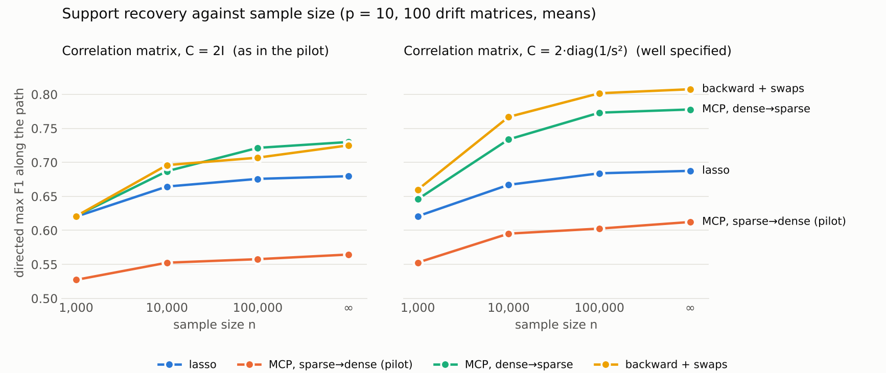
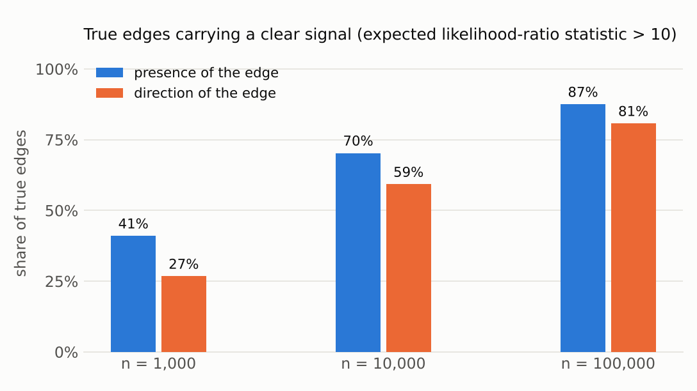
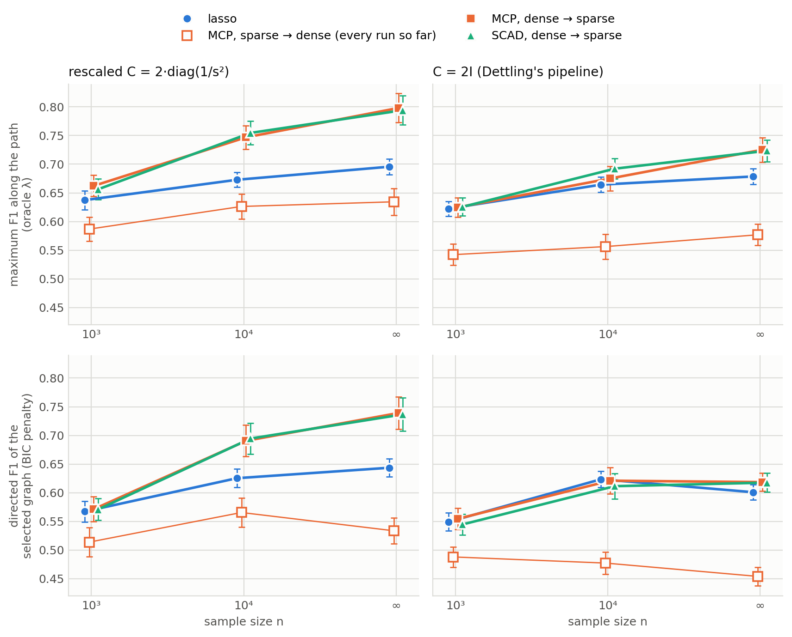
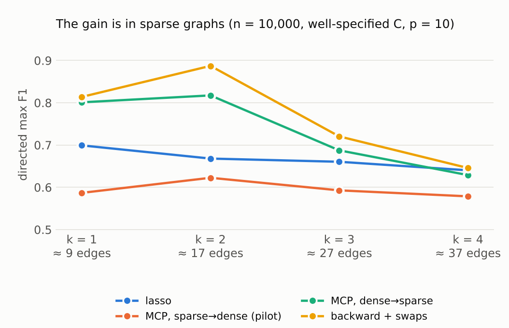

# Independent study, 2 October 2026 — nonconvex penalties for GCLMs: why the pilot is negative, where the penalties do help, and what to run next

*Everything here was computed in a cloud sandbox from the public repository (written against `a235bb9`; the
Simulation plans S3a/S3b and the notes of 1–2 October, commit `601b895`, were read afterwards). Nothing ran on the laptop or on LRZ. Code, raw results and the script that
prints every table are in [`independent_study/`](independent_study/).
Unless stated otherwise: $p = 10$, Dettling's DGP with `C_ID`, $k \in \{1,2,3,4\}$, the repo's seeds
(`default_rng([20260922, p, k, C, rep])`, so the datasets at $n = 1000$ are the pilot's own), the
repo's 100-point $\lambda$ grid and metric functions. "Paired $z$" is the mean paired difference
over the same drift matrices divided by its standard error.*

## 0. Short version

**The pilot is right, and more data will not change it.** On the pilot's setup — standardized
data, $C = 2I$, path from $\lambda_{\max}$ downwards — MCP is 0.09 below the lasso in `max_f1` at
$n = 1000$ (paired $z = -9$) and still 0.12 below at $n = \infty$; SCAD is 0.05 and 0.07 below. The
$n$-sweep submitted to LRZ runs exactly these cells, so it will show the nonconvex penalties
losing at every sample size (§4).

**Two of the three reasons are not about the penalty.**

*The fitted model is wrong once the data are standardized (§2).* Standardizing is a change of
variables that keeps the support of $M$ but turns the volatility matrix $2I$ into
$2\,\mathrm{diag}(1/\Sigma_{ii})$. Fitting $C = 2I$ to a correlation matrix is therefore a
misspecified model even for `C_ID`: at $n = 1000$ a likelihood-ratio test rejects the *true* graph
in 34 % of the datasets at the 5 % level, at $n = 10^4$ in 75 %; with the rescaled $C$ the rejection
rates are 4 % and 3 %. The lasso hardly notices. Estimators that try to fit a sparse model
exactly do.

*A path that runs from sparse to dense decides the orientation of an edge too early (§4).*
In this model the presence of an edge is a first-order effect in the covariance and its direction a
second-order one (§3). At the sparse end of the path the two directions of an edge are almost
indistinguishable; MCP and SCAD then keep whichever entered first. The same penalty, same
$\gamma$, same objective, run from the dense end of the lasso path towards $\lambda_{\max}$
beats the lasso instead of losing to it.

*The third reason is information (§3).* With $N(0,1)$ edge weights and $n = 1000$, 47 % of the
true edges carry less than a $2\sigma$ signal about their *presence*, and 60 % of the
single-direction edges less than $2\sigma$ about their *direction* — for an oracle that knows the
rest of the graph and uses the likelihood. No penalty repairs that. It is also why keeping both
directions of an uncertain edge, as the lasso does, is the better answer under directed $F_1$
whenever the direction can be guessed with less than 2/3 accuracy.

**What works (§5–§9).** With the rescaled $C$, estimators that start from the dense end and prune
— MCP run dense-to-sparse, MCP by local linear approximation from the lasso, the adaptive lasso
weighted by the minimum-$\ell_1$ exact solution, backward elimination with exchange moves — beat
the lasso on every metric, by a margin that grows with $n$ up to $10^5$:

| `max_f1`, rescaled $C$ (paired $z$ vs lasso) | $n = 10^3$ | $10^4$ | $10^5$ | $\infty$ |
|---|---|---|---|---|
| lasso | 0.621 | 0.667 | 0.684 | 0.688 |
| MCP, sparse → dense (the pilot's path) | 0.553 (−6.6) | 0.595 (−6.6) | 0.603 (−7.4) | 0.612 (−6.9) |
| MCP, dense → sparse | 0.646 (+2.1) | 0.734 (+6.3) | 0.773 (+8.3) | 0.778 (+7.1) |
| adaptive lasso from the min-$\ell_1$ solution | 0.646 (+2.1) | 0.724 (+5.3) | 0.766 (+8.0) | 0.763 (+6.1) |
| backward elimination + exchange moves | 0.660 (+2.9) | 0.767 (+7.2) | 0.802 (+8.7) | 0.808 (+8.1) |

The gain sits in the sparse graphs ($k = 1, 2$: +0.04 to +0.12 at $n = 1000$, +0.14 to +0.23 at
$n = 10^5$); for $k = 4$, where two thirds of the edges are undetectable at $n = 1000$, the lasso
is best or within 0.01 of the best. With BIC tuning instead of the oracle path maximum the picture is the same and the
structural Hamming distance drops from 17 to 13 ($n = 10^3$) and from 16 to 10.5–11.7 ($n = 10^4$).

**Three further results.**

*The scale decides what $\ell_1$ targets (§8).* Standardizing is a weighted $\ell_1$ penalty (weight
$\sigma_j/\sigma_i$ on $\lvert M_{ij}\rvert$) that removes the variance ordering the raw-scale lasso exploits to orient
edges. In Dettling's Example 2 the minimum-$\ell_1$ exact fit is the wrong DAG on the raw scale and the true 5-cycle
on the standardized scale with the matching $C$; on the other hand the lasso then loses the path graph it
recovers perfectly on the raw scale. The raw-scale conclusions of that example do not carry over to the
pipeline of Figure 5.

*The BIC search of S3b is a cheap finishing step, and the start matters more than the search (§9).* From the
minimum-$\ell_1$ exact fit it lifts $F_1$ by 0.13 to 0.22; from the MCP pilot's graph by at most 0.07; from
dense → sparse estimators by at most 0.03. Delete and reverse moves are enough at $n \le 10^4$.

*A nonconvex penalty with a convex objective (GMC) is only marginally better than the lasso (§10),* and
reporting both directions of pairs whose direction the data cannot tell (§12) gains 0.02–0.03 $F_1$ for the
estimators that commit.

**So, are nonconvex penalties helpful at all?** Yes — as a de-biasing and pruning step applied to
a dense, lasso-type start, on a correctly specified problem, and mostly when the graph is sparse
and $n \gtrsim 10^4$. Not as a replacement for the lasso on the pilot's path, at any $n$.

**What I would change first** (details in §13): add `--c-scale variance` and `--direction up` to
the remaining LRZ cells (both are in the patch that comes with this memo and leave the defaults
bit-identical); report skeleton and orientation separately and add BIC-selected graphs; and treat
"dense-to-sparse" as the definition of the nonconvex estimators.

## 1. What was run

Solvers. The repo's Python solvers are too slow for a study of this size on two cores, so I
rewrote the same algorithms in C (`lyapcd.c`, called through `fastlyap.py`) and validated them
against the repo:

| | implementation here | check against the repo |
|---|---|---|
| lasso | exact path by LARS on the explicit design, the unpenalised diagonal projected out | objective equal to `solve_fista` at `tol=1e-10` to $10^{-13}$, identical supports on all $\lambda$ (four datasets, $p = 10, 20$) |
| MCP / SCAD, sparse → dense | monotone APG of Li & Lin, a line-by-line port of `_solve_mapg` | same supports at 99–100 % of the $\lambda$'s, identical `max_f1` / `auc`, 60× faster (six paths) |
| MCP / SCAD, coordinate descent | residual-update CD, $O(p)$ per coordinate | stationarity $\le 10^{-8}$; reaches *different* stationary points than the APG (§4) |
| end to end | — | on 20 of the pilot's datasets the repo's own driver (`simulations/run_s1.py`) and this pipeline give identical `max_f1`, `auc`, `aupr` for MCP and SCAD (60 / 60 numbers), identical `max_f1` for the lasso, and lasso `auc` / `aupr` within 0.0024 (`check_vs_repo_driver.py`) |

The estimators that are compared, all on the direct loss and the repo's $\lambda$ grid:

| name in the tables | what it is |
|---|---|
| `lasso` | Direct Lyapunov Lasso |
| `mcp_mapg`, `scad_mapg` | the pilot's estimators: MCP ($\gamma = 3$), SCAD ($\gamma = 3.7$), continuation from $\lambda_{\max}$ down |
| `fwd` | forward stepwise selection on the direct loss (the $\ell_0$ analogue of a sparse → dense path) |
| `mcp_up` | MCP ($\gamma = 3$), continuation from the lasso solution at $\lambda_{\min}$ **up** to $\lambda_{\max}$ |
| `mcp_lla` | MCP by two local-linear-approximation steps started, at each $\lambda$, from the lasso solution at that $\lambda$ (Fan, Xue & Zou 2014) |
| `thr_bp` | the lasso solution at $\lambda_{\min}$ (≈ the minimum-$\ell_1$ exact solution, "basis pursuit"), hard-thresholded; the path is over the threshold |
| `adalasso_bp` | adaptive lasso with weights $1/\lvert\hat M^{\mathrm{BP}}_{ij}\rvert$ |
| `bwd`, `bwd_swap` | backward elimination on the direct loss from the support of the BP solution, without / with exchange moves (swap one selected entry for one unselected entry; an edge reversal is such a swap) |
| `fwd_swap` | forward stepwise with exchange moves |
| `mcp_swap`, `scad_swap` | coordinate-descent continuation from $\lambda_{\max}$ in which every selected edge is tentatively reversed and the move kept if the objective decreases |

Formulations of the input (§2): `identity` — correlation matrix with $C = 2I$, the pilot's
setting; `variance` — correlation matrix with $C = 2\,\mathrm{diag}(1/\hat\Sigma_{ii})$.

Experiments (`e0` … `e11` in the folder; `analyze.py` prints the tables):

| | question | datasets |
|---|---|---|
| E0 | does the true graph fit the model that is being fitted? | 100 drift matrices × $n \in \{10^3, 10^4\}$ |
| E1 | formulation × penalty × $n$, and MCP started at the truth | 52 × $n \in \{10^3, 10^4, 10^5, \infty\}$ |
| E2 | how much information does each true edge carry? | 100 (and two strong-signal variants) |
| E3 | all estimators above, both formulations, path metrics and BIC | 100 × 4 sample sizes |
| E5 | $\gamma$ sweep for the pilot's estimators | 52 × $n \in \{10^3, \infty\}$ |
| E6 | orient-or-abstain on BIC-selected graphs | 100 × $n \in \{10^3, 10^4\}$ (52 for strong signals) |
| E7 | path direction × solver × penalty | 52 × 4 sample sizes (52 × 3 for strong signals) |
| E3′ | E3 with strong signals and no 2-cycles | 52 × $n \in \{10^3, 10^4, \infty\}$ |
| E4 | E3 (reduced) at $p = 20$ | 24 × $n \in \{10^3, 10^4, \infty\}$ |
| E8 | GMC penalty (Selesnick 2017) | 52 × $n \in \{10^3, 10^4, \infty\}$ |
| E9 | minimum-$\ell_1$ exact solution at the population level | 100 drift matrices |
| E10 | Dettling's Example 2 (path and 5-cycle), all estimators | 1002 datasets |
| E11 | trial of the BIC search of `S3b_reversal_search.md` | 40 graphs × $n \in \{10^3, 10^4, \infty\}$ |

## 2. After standardization, $C = 2I$ is the wrong model

Let $D = \mathrm{diag}(\Sigma_{11}^{1/2}, \dots, \Sigma_{pp}^{1/2})$ and $R = D^{-1}\Sigma D^{-1}$.
Multiplying the Lyapunov equation by $D^{-1}$ from both sides gives

$$\tilde M R + R\tilde M^\top + D^{-1} C D^{-1} = 0, \qquad \tilde M = D^{-1} M D .$$

So $\tilde M$ has the support of $M$ (the reason `S1_reproduction.md` §4.1 gives for standardizing
being harmless), but the volatility matrix on the correlation scale is $D^{-1}CD^{-1}$. For
`C_ID` that is $2\,\mathrm{diag}(1/\Sigma_{ii})$, not $2I$. The repo estimates with
`c_est = 2 * np.eye(p)` after standardizing, so every run so far — including "`C_ID`", the setting
meant to be well specified — fits a model the data do not follow. The size of the mismatch is the
spread of the variances: in this DGP $\max_i\Sigma_{ii}/\min_i\Sigma_{ii}$ has median 5.4, mean 16
and 90 % quantile 19 at $p = 10$, larger than the spread of Dettling's deliberately misspecified
`C_Random_Diag` ($C_{ii} \in [0.5, 4]$, a factor of at most 8).

Three measurements (`e0_misspec.py`, `e1_formulations.py`):

| | `identity` ($C = 2I$ on $R$) | `variance` ($C = 2\,\mathrm{diag}(1/\hat\Sigma_{ii})$ on $R$) |
|---|---|---|
| least-squares loss on the **true** support at $n = \infty$ (0 = the truth is an exact solution) | 0.069, 1.5 % of the loss of the diagonal fit | 0 (to $10^{-28}$) |
| likelihood-ratio statistic of the true graph against the saturated model, divided by its degrees of freedom, $n = 10^3$ / $10^4$ | 1.76 / 9.06 | 0.96 / 0.94 |
| true graph rejected at the 5 % level, $n = 10^3$ / $10^4$ | 34 % / 75 % | 4 % / 3 % |
| MCP started from the least-squares fit on the true support: `max_f1` at $n = \infty$, share of drift matrices recovered exactly | 0.885, 10 % | 0.999, 94 % |

The `variance` formulation is not a new model. It is the unstandardized problem with $C = 2I$
written in the variable $\tilde M$: the loss becomes
$\tfrac12\lVert D^{-1}(M\hat\Sigma + \hat\Sigma M^\top + 2I)D^{-1}\rVert_F^2$ and the penalty
$\lambda\sum_{i\neq j}\lvert M_{ij}\rvert D_{jj}/D_{ii}$ (checked numerically to $10^{-14}$). It
keeps what standardizing is good for — columns of comparable norm — without changing the model.
For Dettling's other three settings it implements "estimate with $C = 2I$" on the scale on which
the data were generated, so the misspecification is the intended one ($C_{ii}/2$) rather than
the intended one multiplied by $1/\Sigma_{ii}$.

How much does it matter? For the lasso, almost nothing: `max_f1` 0.620 vs 0.621 at $n = 1000$ and
0.680 vs 0.688 at $n = \infty$ (E3). This is Dettling's robustness finding, and it is why the
reproduction of Figure 5 was unaffected. For anything that commits to a sparse fit it matters
more as $n$ grows: under `identity` the best estimators of §5 stop at `max_f1` ≈ 0.73 for
$n = \infty$, under `variance` they reach 0.78–0.81, and BIC, which compares likelihoods of a
wrong model, stops improving: BIC-selected $F_1$ barely changes from $10^4$ to $10^5$ under `identity`
(`mcp_up` 0.625 → 0.641, lasso 0.619 → 0.611) but keeps improving under `variance` (0.683 → 0.724) (§5).

One consequence for the write-up: on the raw scale the lasso's orientation is biased towards
"the high-variance node is the parent" (§3), and in this DGP that is true for 65 % of the edges,
because $M_{ii} = -\sum_j\lvert M_{ij}\rvert - \lvert\varepsilon_{ii}\rvert$ gives nodes with more
parents a faster mean reversion and a smaller variance. That is the Lyapunov analogue of
var-sortability in simulated DAGs (Reisach, Seiler & Weichwald 2021); standardizing removes it,
which is a good reason to keep standardizing — with the matching $C$.

## 3. Presence is a first-order effect, direction a second-order one

Write $M = -D_0 + \varepsilon B$ with $D_0 = \mathrm{diag}(d)$, $B$ off-diagonal, $C = 2I$.
Expanding the Lyapunov equation in $\varepsilon$ (checked numerically, `README` §checks):

$$\Sigma = D_0^{-1} + \varepsilon\,\Sigma_1 + \varepsilon^2\Sigma_2 + O(\varepsilon^3),\qquad
(\Sigma_1)_{ij} = \frac{d_i B_{ij} + d_j B_{ji}}{d_i d_j (d_i + d_j)},\qquad
(\Sigma_2)_{ij} = \frac{(B\Sigma_1 + \Sigma_1 B^\top)_{ij}}{d_i + d_j}.$$

*First order.* A pair $\{i, j\}$ enters $\Sigma_1$ only through $d_i B_{ij} + d_j B_{ji}$: the
covariance sees that the pair is connected and how strongly, not in which direction. In the
regression view the two columns of the design that belong to $M_{ij}$ and $M_{ji}$ are exactly
parallel at $\varepsilon = 0$, with norms in the ratio $d_i : d_j$. The $\ell_1$ penalty breaks the
tie in favour of the longer column, i.e. it makes the node with the smaller $d$ — the larger
variance — the parent. That is Dettling's Theorem 3 (irrepresentability near $-D_0$ iff
$d_i < d_j$ for every edge $i \to j$) read as a statement about what the lasso does rather than
about when it is right. On the correlation scale the ratio is 1 for every edge: both directions
enter together, which is the hedging seen in `S2_penalties_losses.md` §3.4, and the
irrepresentability constant of every edge tends to exactly 1 as the coupling vanishes.

*Second order.* Take two edges that share a node $k$, with the other endpoints $i, j$ not adjacent,
and write $a = (\Sigma_1)_{ik}$, $b = (\Sigma_1)_{kj}$. Then

| orientation | $(\Sigma_2)_{ij}$ |
|---|---|
| collider $i \to k \leftarrow j$ | $0$ |
| chain $i \to k \to j$ | $ab\, d_k (d_k + d_j)/(d_i + d_j)$ |
| chain $j \to k \to i$ | $ab\, d_k (d_k + d_i)/(d_i + d_j)$ |
| fork $i \leftarrow k \to j$ | the sum of the two chain values |

The four orientations are distinguishable through the covariance of the two *non-adjacent*
endpoints, at order $\varepsilon^2$, and the two chains only if $d_i \neq d_j$. An isolated edge
has no such partner and cannot be oriented at all. This is the local version of the structural
identifiability result of Améndola, Boege, Hollering & Misra (2025): equivalence classes of
acyclic GCLMs are finer than Markov equivalence classes, but an edge is oriented by its
neighbourhood, not by itself. It also shows what the `identity` formulation does to the
orientation: it evaluates these formulas with $d \equiv 1$ while the data follow them with the
true $d$.

*What that means in numbers* (`e2_identifiability.py`). For every true edge $e$ of 100 drift
matrices I computed, in the population and in the well-specified model,
$D_{\mathrm{del}}(e)$ and $D_{\mathrm{rev}}(e)$: the smallest Gaussian deviance, per observation,
between $\Sigma^\ast$ and the model with $e$ deleted, respectively reversed (everything else free).
$n D$ is the expected likelihood-ratio statistic; an oracle that knows the rest of the graph
orients an edge correctly with probability about $\Phi(\sqrt{nD_{\mathrm{rev}}}/2)$.

| edge weights | $n$ | presence: $nD < 4$ | presence: $nD > 10$ | direction: $nD < 4$ | direction: $nD > 10$ | oracle orientation accuracy | edges the oracle orients with accuracy > 2/3 |
|---|---|---|---|---|---|---|---|
| $N(0,1)$ weights (thesis DGP) | $1{,}000$ | 47% | 41% | 60% | 27% | 0.77 | 63% |
| $N(0,1)$ weights (thesis DGP) | $10^4$ | 22% | 70% | 31% | 59% | 0.88 | 83% |
| $N(0,1)$ weights (thesis DGP) | $10^5$ | 9% | 87% | 13% | 81% | 0.95 | 93% |
| $\lvert w\rvert \sim U[0.5, 1]$ | $1{,}000$ | 34% | 50% | 58% | 24% | 0.79 | 74% |
| $\lvert w\rvert \sim U[0.5, 1]$ | $10^4$ | 11% | 81% | 18% | 68% | 0.93 | 94% |
| $\lvert w\rvert \sim U[0.5, 1]$ | $10^5$ | 3% | 95% | 4% | 93% | 0.98 | 98% |
| $\lvert w\rvert \sim U[0.5, 1]$, no 2-cycles | $1{,}000$ | 2% | 87% | 48% | 32% | 0.84 | 88% |
| $\lvert w\rvert \sim U[0.5, 1]$, no 2-cycles | $10^4$ | 0% | 100% | 6% | 84% | 0.97 | 99% |
| $\lvert w\rvert \sim U[0.5, 1]$, no 2-cycles | $10^5$ | 0% | 100% | 1% | 99% | 1.00 | 99% |

At $n = 1000$ the thesis DGP is a low-information problem: 47 % of the true edges are below
$2\sigma$ for presence, 60 % of the single-direction edges below $2\sigma$ for direction (median
$D_{\mathrm{rev}}/D_{\mathrm{del}} = 0.18$), and 31 % of all true edges sit in 2-cycles. The dense
graphs are the worst: at $k = 4$, 68 % of the edges are below $2\sigma$ for presence. Edges with
$\lvert M_{ij}\rvert < 0.3$ (23 % of them under $N(0,1)$ weights) carry essentially nothing.

*Why the lasso's hedge is rational.* For a detected true edge, reporting both directions costs
one false positive; committing to one direction with accuracy $q$ costs a false positive and a
false negative with probability $1 - q$. Over many such edges the first gives $F_1 = 2/3$, the
second $F_1 = q$. Committing pays only when $q > 2/3$. In the pilot MCP oriented its committed
edges with accuracy $7.7/(7.7+3.5) = 0.69$ — break-even — and gave up the 2-cycles. At $n = 1000$
even the oracle is below 2/3 on 37 % of the edges.

## 4. The MCP objective is fine. The sparse-to-dense path is not.

*The pilot reproduces and does not improve with $n$* (E3, 100 drift matrices, `identity`):

| `max_f1` (paired $z$ vs lasso) | $n = 10^3$ | $10^4$ | $10^5$ | $\infty$ |
|---|---|---|---|---|
| lasso | 0.620 | 0.664 | 0.676 | 0.680 |
| MCP, $\gamma = 3$ | 0.527 (−9.0) | 0.552 (−9.7) | 0.558 (−10.6) | 0.564 (−10.4) |
| SCAD, $\gamma = 3.7$ | 0.567 (−7.2) | 0.600 (−7.8) | 0.605 (−8.4) | 0.607 (−8.6) |

The skeleton is again nearly unaffected (`sk_f1` 0.786 vs 0.804 at $n = 1000$), as in
`S2_penalties_losses.md` §3.4.

> **Added 5 October 2026 (not part of the original memo): the cluster sweep confirms this.**
> The n-sweep on LRZ ran these cells for all three losses at $p = 10, 20$ (800 graphs per cell,
> all four $C$ settings). MCP and SCAD are below the lasso in every cell, and the gap grows with
> $n$ (`simulations/S2b_nsweep.md`).
>
> 

*The objective has a much better stationary point.* Starting MCP at every $\lambda$ from the
least-squares fit on the true support (E1, 52 drift matrices) gives `max_f1` 0.80 at $n = 1000$
on either formulation, against 0.53–0.57 for the continuation path and 0.62–0.63 for the lasso;
with the `variance` formulation it gives 0.92, 0.96 and 0.999 at $n = 10^4$, $10^5$, $\infty$.
This is an oracle, not an estimator, but it shows that the penalty is not the limit.

*A lower objective is not a better graph at finite $n$.* The reversal-move variant `mcp_swap`
finds objectives below those of the oracle-started solution at 75 % of the $\lambda$'s at
$n = 1000$ (`variance`), and above at 7 %, and yet its `max_f1` is 0.63 against the oracle's 0.82
(E3, last table). This is the repo's "the right basin has the lower objective in 42 % of the
datasets" seen from the other side. The useful solutions are *selected by the starting point*,
not by the objective value.

*Forward and backward.* What separates the estimators that lose from the ones that win is the
direction in which they move through model space:

`identity` formulation (52 drift matrices)

| `max_f1` (paired $z$ vs lasso) | $n = 1,000$ | $n = 10^4$ | $n = 10^5$ | $n = ∞$ |
|---|---|---|---|---|
| lasso | 0.617 | 0.661 | 0.672 | 0.677 |
| MCP $\gamma=3$, sparse → dense, APG (the pilot) | 0.530 (-6.3) | 0.543 (-6.9) | 0.551 (-7.5) | 0.558 (-7.5) |
| MCP $\gamma=3$, sparse → dense, CD | 0.523 (-7.0) | 0.548 (-7.2) | 0.562 (-7.4) | 0.560 (-7.5) |
| MCP $\gamma=3$, dense → sparse, APG | 0.624 (+0.5) | 0.679 (+1.2) | 0.715 (+3.4) | 0.724 (+4.0) |
| MCP $\gamma=3$, dense → sparse, CD | 0.623 (+0.5) | 0.679 (+1.2) | 0.717 (+3.7) | 0.732 (+4.3) |
| MCP $\gamma=10$, sparse → dense, APG | 0.564 (-5.1) | 0.615 (-3.5) | 0.615 (-4.5) | 0.623 (-4.2) |
| MCP $\gamma=10$, dense → sparse, APG | 0.613 (-0.4) | 0.670 (+0.8) | 0.698 (+2.7) | 0.705 (+2.6) |
| SCAD $\gamma=3.7$, sparse → dense, APG (the pilot) | 0.565 (-5.6) | 0.603 (-4.5) | 0.613 (-4.8) | 0.610 (-5.3) |
| SCAD $\gamma=3.7$, dense → sparse, APG | 0.622 (+0.6) | 0.691 (+3.1) | 0.715 (+4.4) | 0.721 (+4.1) |

`variance` formulation (52 drift matrices)

| `max_f1` (paired $z$ vs lasso) | $n = 1,000$ | $n = 10^4$ | $n = 10^5$ | $n = ∞$ |
|---|---|---|---|---|
| lasso | 0.633 | 0.669 | 0.680 | 0.685 |
| MCP $\gamma=3$, sparse → dense, APG (the pilot) | 0.570 (-4.0) | 0.606 (-4.1) | 0.603 (-5.1) | 0.619 (-4.0) |
| MCP $\gamma=3$, sparse → dense, CD | 0.556 (-5.7) | 0.589 (-5.6) | 0.593 (-6.0) | 0.601 (-5.4) |
| MCP $\gamma=3$, dense → sparse, APG | 0.648 (+0.9) | 0.742 (+4.9) | 0.773 (+6.7) | 0.777 (+6.1) |
| MCP $\gamma=3$, dense → sparse, CD | 0.647 (+0.8) | 0.739 (+4.8) | 0.767 (+6.3) | 0.775 (+5.9) |
| MCP $\gamma=10$, sparse → dense, APG | 0.600 (-3.0) | 0.636 (-2.2) | 0.651 (-2.1) | 0.660 (-1.6) |
| MCP $\gamma=10$, dense → sparse, APG | 0.634 (+0.2) | 0.719 (+3.7) | 0.755 (+5.3) | 0.766 (+5.5) |
| SCAD $\gamma=3.7$, sparse → dense, APG (the pilot) | 0.601 (-2.5) | 0.626 (-3.4) | 0.640 (-3.0) | 0.658 (-1.8) |
| SCAD $\gamma=3.7$, dense → sparse, APG | 0.647 (+1.0) | 0.746 (+5.7) | 0.773 (+6.7) | 0.778 (+6.1) |

A sparse-to-dense path has to choose the direction of an edge when that edge first enters, at a
$\lambda$ at which every other coefficient is still zero or heavily shrunk — that is, using
exactly the first-order information that §3 shows to be uninformative (on the correlation scale)
or biased (on the raw scale). The lasso is convex, so it revises the choice at every $\lambda$;
MCP and SCAD freeze it (the barrier of `S2_penalties_losses.md` §3.1); forward stepwise freezes
it too, and behaves the same way (`fwd` −0.07 under `identity`). A dense-to-sparse path starts
from an exact solution of the Lyapunov equation in which both directions of every uncertain pair
are present, so the second-order terms are already accounted for, and it only has to decide
which of the two directions to drop. Varando & Hansen (2020, §3.1) report the same observation
for their likelihood path without explaining it: "better results were obtained using an
increasing sequence of regularization parameters".

Two practical points. The dense-to-sparse path is far less solver-dependent: coordinate descent
and the monotone APG differ in `max_f1` by 0.004 per dataset on average, against 0.013 on the
sparse-to-dense path, where the two solvers can land on visibly different stationary points
(0.415 vs 0.638 on the first $k = 2$ dataset). And the starting point is free of tuning:
it is the lasso solution at the smallest $\lambda$ of the grid, which is within solver tolerance
of the minimum-$\ell_1$ exact solution
$\min \lVert M_{\mathrm{off}}\rVert_1$ s.t. $M\hat\Sigma + \hat\Sigma M^\top + C = 0$. Every exact
solution has the form $M = (W - C/2)\hat\Sigma^{-1}$ with $W$ skew-symmetric, so this is a linear
program in the $p(p-1)/2$ free entries of $W$ that needs no $p^2 \times p^2$ design
(`methods.bp_lp`: 0.03 s at $p = 10$, 9 s at $p = 40$, identical to the LARS solution to
$10^{-11}$).

> **Added 5 October 2026 (not part of the original memo): replication with the repository's
> solvers.** The same comparison on 40 `C_ID` graphs ($p = 10$), computed with `lasso_path` and
> `solve_fista` of the thesis repository (`next_steps/031026/next_steps_031026.md` §4). Dense →
> sparse beats the lasso with the rescaled $C$ and only ties it with $C = 2I$; the path of the
> pilot loses on both.
>
> 

## 5. Bake-off

E3, 100 drift matrices. Paired $z$ against the lasso on the same formulation in brackets;
`bic_*` is the graph selected by BIC along each path, each candidate support refitted by Gaussian
maximum likelihood as in Dettling's equation (6.2) with $\gamma = 0$; `shd` counts a reversed
edge once.

**$n = 1,000$** (100 drift matrices)

| method | `max_f1` identity | `max_f1` variance | `aupr` variance | `sk_f1` variance | BIC `f1` identity | BIC `f1` variance | BIC `shd` identity | BIC `shd` variance |
|---|---|---|---|---|---|---|---|---|
| `lasso` | 0.620 | 0.621 | 0.526 | 0.793 | 0.551 | 0.549 | 16.0 | 17.1 |
| `mcp_mapg` | 0.527 (-9.0) | 0.553 (-6.6) | 0.480 (-5.5) | 0.784 (-1.2) | 0.469 (-7.0) | 0.482 (-5.9) | 16.3 (+1.0) | 17.0 (-0.3) |
| `scad_mapg` | 0.567 (-7.2) | 0.597 (-2.6) | 0.486 (-6.9) | 0.790 (-0.5) | 0.493 (-5.9) | 0.513 (-3.7) | 16.3 (+1.3) | 16.7 (-1.2) |
| `fwd` | 0.548 (-6.6) | 0.622 (+0.1) | 0.592 (+4.3) | 0.812 (+2.0) | 0.479 (-5.8) | 0.554 (+0.4) | 15.3 (-2.1) | 14.1 (-6.1) |
| `mcp_lla` | 0.619 (-0.3) | 0.643 (+3.5) | 0.536 (+2.1) | 0.812 (+4.1) | 0.521 (-3.0) | 0.553 (+0.4) | 14.9 (-3.8) | 14.9 (-7.3) |
| `mcp_up` | 0.621 (+0.1) | 0.646 (+2.1) | 0.565 (+3.9) | 0.822 (+4.3) | 0.540 (-1.0) | 0.577 (+2.0) | 14.3 (-6.1) | 13.5 (-7.3) |
| `adalasso_bp` | 0.619 (-0.1) | 0.646 (+2.1) | 0.649 (+8.2) | 0.826 (+4.1) | 0.550 (-0.2) | 0.582 (+2.5) | 14.2 (-6.0) | 13.4 (-7.7) |
| `thr_bp` | 0.618 (-0.3) | 0.646 (+2.6) | 0.647 (+8.7) | 0.831 (+4.9) | 0.546 (-0.5) | 0.580 (+2.4) | 14.8 (-4.0) | 13.9 (-6.5) |
| `bwd` | 0.612 (-0.9) | 0.643 (+1.8) | 0.635 (+6.8) | 0.832 (+4.8) | 0.529 (-1.7) | 0.565 (+1.1) | 14.3 (-5.5) | 13.5 (-7.8) |
| `bwd_swap` | 0.621 (+0.1) | 0.660 (+2.9) | 0.595 (+5.5) | 0.831 (+4.2) | 0.516 (-2.5) | 0.564 (+1.0) | 14.5 (-4.8) | 13.4 (-6.8) |
| `fwd_swap` | 0.577 (-4.0) | 0.647 (+1.7) | 0.603 (+4.9) | 0.832 (+4.0) | 0.477 (-6.3) | 0.573 (+1.5) | 15.3 (-2.3) | 13.2 (-6.7) |
| `mcp_swap` | 0.579 (-3.8) | 0.631 (+1.1) | 0.519 (-0.9) | 0.811 (+3.5) | 0.499 (-3.5) | 0.549 (+0.0) | 15.0 (-3.2) | 14.8 (-6.0) |
| `scad_swap` | 0.601 (-2.5) | 0.634 (+1.6) | 0.499 (-5.2) | 0.810 (+4.0) | 0.514 (-2.8) | 0.529 (-1.7) | 15.6 (-1.4) | 16.2 (-2.3) |

**$n = 10^4$** (100 drift matrices)

| method | `max_f1` identity | `max_f1` variance | `aupr` variance | `sk_f1` variance | BIC `f1` identity | BIC `f1` variance | BIC `shd` identity | BIC `shd` variance |
|---|---|---|---|---|---|---|---|---|
| `lasso` | 0.664 | 0.667 | 0.559 | 0.843 | 0.619 | 0.620 | 16.2 | 15.9 |
| `mcp_mapg` | 0.552 (-9.7) | 0.595 (-6.6) | 0.516 (-4.3) | 0.831 (-1.6) | 0.481 (-11.9) | 0.530 (-6.6) | 18.1 (+4.9) | 16.9 (+1.9) |
| `scad_mapg` | 0.600 (-7.8) | 0.634 (-3.2) | 0.505 (-6.9) | 0.848 (+0.8) | 0.510 (-10.2) | 0.556 (-4.5) | 17.3 (+2.7) | 16.1 (+0.3) |
| `fwd` | 0.597 (-5.9) | 0.648 (-1.4) | 0.604 (+2.5) | 0.858 (+1.8) | 0.551 (-5.6) | 0.603 (-1.2) | 15.4 (-1.9) | 14.1 (-3.5) |
| `mcp_lla` | 0.693 (+4.1) | 0.723 (+6.6) | 0.590 (+5.3) | 0.881 (+6.6) | 0.626 (+1.0) | 0.664 (+3.8) | 14.1 (-7.2) | 12.6 (-7.8) |
| `mcp_up` | 0.687 (+2.1) | 0.734 (+6.3) | 0.640 (+7.2) | 0.890 (+7.6) | 0.625 (+0.5) | 0.683 (+4.6) | 13.4 (-8.3) | 11.6 (-9.2) |
| `adalasso_bp` | 0.681 (+1.8) | 0.724 (+5.3) | 0.738 (+10.9) | 0.883 (+6.9) | 0.624 (+0.6) | 0.685 (+5.3) | 13.8 (-7.9) | 11.7 (-9.4) |
| `thr_bp` | 0.679 (+1.9) | 0.720 (+5.9) | 0.731 (+10.9) | 0.884 (+7.3) | 0.633 (+1.5) | 0.681 (+5.3) | 14.2 (-6.2) | 12.5 (-8.1) |
| `bwd` | 0.682 (+1.7) | 0.718 (+4.5) | 0.718 (+8.6) | 0.884 (+7.2) | 0.618 (-0.1) | 0.677 (+4.1) | 13.5 (-8.4) | 11.7 (-9.1) |
| `bwd_swap` | 0.696 (+2.9) | 0.767 (+7.2) | 0.689 (+8.3) | 0.898 (+7.4) | 0.603 (-1.2) | 0.713 (+5.6) | 13.8 (-6.7) | 10.5 (-8.9) |
| `fwd_swap` | 0.621 (-4.1) | 0.699 (+2.2) | 0.638 (+4.4) | 0.873 (+3.9) | 0.556 (-5.2) | 0.651 (+1.9) | 14.9 (-3.1) | 12.0 (-7.1) |
| `mcp_swap` | 0.655 (-0.8) | 0.726 (+5.3) | 0.591 (+3.2) | 0.880 (+5.6) | 0.582 (-2.7) | 0.661 (+2.6) | 14.6 (-3.7) | 12.4 (-6.5) |
| `scad_swap` | 0.656 (-1.1) | 0.712 (+4.0) | 0.551 (-1.2) | 0.878 (+5.2) | 0.573 (-3.6) | 0.642 (+1.5) | 15.4 (-2.0) | 13.3 (-4.8) |

**large $n$**: `max_f1` (paired $z$), share of drift matrices whose support is recovered exactly somewhere on the path

| method | 10^5 identity | 10^5 variance | ∞ identity | ∞ variance |
|---|---|---|---|---|
| `lasso` | 0.676, 0% | 0.684, 0% | 0.680, 0% | 0.688, 0% |
| `mcp_mapg` | 0.558 (-10.6), 0% | 0.603 (-7.4), 0% | 0.564 (-10.4), 0% | 0.612 (-6.9), 1% |
| `scad_mapg` | 0.605 (-8.4), 0% | 0.650 (-3.2), 2% | 0.607 (-8.6), 0% | 0.659 (-2.6), 3% |
| `fwd` | 0.592 (-7.0), 0% | 0.689 (+0.4), 3% | 0.594 (-7.0), 0% | 0.697 (+0.6), 6% |
| `mcp_lla` | 0.716 (+5.8), 2% | 0.764 (+7.8), 7% | 0.721 (+6.1), 3% | 0.777 (+8.5), 15% |
| `mcp_up` | 0.721 (+5.1), 2% | 0.773 (+8.3), 7% | 0.730 (+5.6), 4% | 0.778 (+7.1), 14% |
| `adalasso_bp` | 0.713 (+4.9), 1% | 0.766 (+8.0), 8% | 0.711 (+4.0), 2% | 0.763 (+6.1), 12% |
| `thr_bp` | 0.705 (+5.2), 0% | 0.757 (+8.5), 3% | 0.701 (+3.6), 0% | 0.764 (+6.5), 13% |
| `bwd` | 0.716 (+4.9), 2% | 0.770 (+8.1), 10% | 0.713 (+4.1), 3% | 0.767 (+6.5), 13% |
| `bwd_swap` | 0.707 (+3.1), 3% | 0.802 (+8.7), 16% | 0.725 (+4.8), 6% | 0.808 (+8.1), 35% |
| `fwd_swap` | 0.645 (-2.8), 1% | 0.746 (+3.7), 11% | 0.644 (-2.8), 2% | 0.770 (+4.7), 24% |
| `mcp_swap` | 0.671 (-0.5), 1% | 0.767 (+6.4), 8% | 0.677 (-0.2), 2% | 0.789 (+6.7), 16% |
| `scad_swap` | 0.678 (+0.2), 0% | 0.762 (+5.9), 8% | 0.684 (+0.5), 1% | 0.794 (+7.6), 18% |

Reading. (i) Under the pilot's formulation at $n = 1000$ nothing beats the lasso on `max_f1` —
the backward estimators tie with it (0.62) — but they order the edges better (`aupr` 0.58–0.60 for `bwd`, `adalasso_bp` and `thr_bp` against 0.52; not for `bwd_swap`, 0.53) and BIC selects better graphs from their paths (structural Hamming distance 14.2–14.8
against 16.0). (ii) With the rescaled $C$ the backward estimators are ahead on every column at
every $n$. (iii) Among them the differences are small next to the gap to the lasso. Backward
elimination with exchange moves is the best at $n \ge 10^4$ and the only one that recovers a
substantial share of the graphs exactly in the population (35 %; 60 % and 64 % for $k = 1, 2$),
but it is also the one that suffers most from the misspecified formulation. (iv) The forward
estimators are the worst of the new estimators under `identity` and unremarkable under `variance`.

By density (`variance`):

| n | k | `lasso` | `mcp_mapg` | `mcp_up` | `adalasso_bp` | `bwd_swap` |
|---|---|---|---|---|---|---|
| 1,000 | 1 | 0.606 | 0.552 | 0.717 | 0.716 | 0.726 |
| 1,000 | 2 | 0.608 | 0.542 | 0.652 | 0.673 | 0.691 |
| 1,000 | 3 | 0.637 | 0.562 | 0.626 | 0.618 | 0.629 |
| 1,000 | 4 | 0.633 | 0.555 | 0.588 | 0.577 | 0.594 |
| 10^4 | 1 | 0.699 | 0.587 | 0.801 | 0.791 | 0.814 |
| 10^4 | 2 | 0.668 | 0.623 | 0.817 | 0.797 | 0.887 |
| 10^4 | 3 | 0.660 | 0.593 | 0.687 | 0.693 | 0.720 |
| 10^4 | 4 | 0.640 | 0.579 | 0.629 | 0.615 | 0.646 |
| 10^5 | 1 | 0.726 | 0.594 | 0.869 | 0.870 | 0.894 |
| 10^5 | 2 | 0.692 | 0.642 | 0.875 | 0.848 | 0.926 |
| 10^5 | 3 | 0.665 | 0.591 | 0.709 | 0.713 | 0.752 |
| 10^5 | 4 | 0.652 | 0.584 | 0.639 | 0.631 | 0.634 |
| ∞ | 1 | 0.725 | 0.632 | 0.877 | 0.840 | 0.880 |
| ∞ | 2 | 0.700 | 0.639 | 0.879 | 0.859 | 0.938 |
| ∞ | 3 | 0.670 | 0.591 | 0.711 | 0.719 | 0.766 |
| ∞ | 4 | 0.655 | 0.588 | 0.644 | 0.637 | 0.646 |

The gain is concentrated where §3 says the information is: sparse graphs. At $k = 4$, close to the
identifiability boundary ($\lvert E\rvert + p = 47$ parameters for 55 covariances) and with 42 % of
the edges in 2-cycles, the lasso is best or within 0.01 of the best at every $n$.

## 6. The $\gamma$ sweep

The pilot's $\gamma$ (3 for MCP, 3.7 for SCAD) is on the concave end. The 1 October notes guessed that larger
$\gamma$ approaches the lasso from below. E5 runs the pilot's own estimator (sparse → dense monotone APG) for
MCP $\gamma \in \{1.5, 2, 3, 5, 10, 30, 100\}$ and SCAD $\gamma \in \{2.5, 3.7, 10, 30, 100\}$ on 52 drift
matrices (`max_f1`, paired $z$ against the lasso in brackets):

| | $n = 10^3$, `identity` | $n = 10^3$, `variance` | $n = \infty$, `identity` | $n = \infty$, `variance` |
|---|---|---|---|---|
| lasso | 0.617 | 0.633 | 0.677 | 0.685 |
| MCP $\gamma = 3$ (pilot) | 0.530 (−6.3) | 0.570 (−4.0) | 0.558 (−7.5) | 0.619 (−4.0) |
| MCP $\gamma = 10$ | 0.564 (−5.1) | 0.600 (−3.0) | 0.623 (−4.2) | 0.660 (−1.6) |
| MCP $\gamma = 30$ | 0.587 (−4.1) | 0.616 (−2.4) | 0.642 (−3.9) | 0.714 (+2.0) |
| MCP $\gamma = 100$ | 0.605 (−2.7) | 0.623 (−2.3) | 0.667 (−1.7) | 0.731 (+3.3) |
| SCAD $\gamma = 3.7$ (pilot) | 0.565 (−5.6) | 0.601 (−2.5) | 0.610 (−5.3) | 0.658 (−1.8) |
| SCAD $\gamma = 100$ | 0.608 (−2.7) | 0.626 (−1.7) | 0.669 (−1.4) | 0.732 (+3.4) |

The deficit shrinks with $\gamma$ for $\gamma \ge 3$ (it is flat or slightly worse between 1.5 and 3), as guessed, and at $n = 10^3$ no $\gamma$ reaches the lasso. The
only cells in which a larger $\gamma$ overtakes it are the well-specified ones at $n = \infty$ ($\gamma \ge 30$,
`variance`: +0.03 to +0.05). `auc` stays below the lasso in every cell (best case $z = -3.1$). For comparison, the
same objective with $\gamma = 3$ run dense → sparse reaches 0.777 in the last column (§4). So $\gamma$ is a weak
lever; the path direction is a strong one. The ordering is also what the mechanism of S2 §3.1 predicts: a large
$\gamma$ keeps the path close to the lasso path it starts from.

## 7. Strong signals without 2-cycles

E3′ repeats the bake-off on a data-generating process designed to remove the information problem of §3: edge
weights $\lvert w\rvert \sim U[0.5, 1]$ with a random sign (a beta-min condition), and one direction of every
2-cycle dropped (no 2-cycles). 52 drift matrices, $p = 10$, $C = 2I$, $k = 1,\dots,4$. At $n = 1000$ the oracle
orients an edge correctly with probability 0.84 on average here, and 87 % of the edges carry a clear presence
signal ($nD > 10$, §3), against 0.77 and 41 % in the thesis DGP.

| `max_f1` (paired $z$ vs lasso) | $n = 10^3$ `identity` | $n = 10^3$ `variance` | $n = 10^4$ `variance` | $n = \infty$ `variance` |
|---|---|---|---|---|
| lasso | 0.623 | 0.622 | 0.665 | 0.686 |
| MCP, sparse → dense (pilot) | 0.533 (−6.1) | 0.581 (−2.8) | 0.588 (−4.8) | 0.593 (−5.7) |
| SCAD, sparse → dense (pilot) | 0.597 (−2.8) | 0.623 (+0.1) | 0.678 (+0.8) | 0.688 (+0.1) |
| MCP, dense → sparse | 0.631 (+0.5) | 0.662 (+2.7) | 0.778 (+6.3) | 0.820 (+8.9) |
| adaptive lasso, BP weights | 0.622 (−0.1) | 0.640 (+0.9) | 0.758 (+4.9) | 0.794 (+6.1) |
| backward + exchange moves | 0.643 (+1.1) | 0.697 (+3.7) | 0.801 (+7.2) | 0.859 (+9.9) |

Share of drift matrices recovered exactly somewhere on the path at $n = \infty$, `variance`: lasso 0 %, MCP
(pilot) 2 %, SCAD (pilot) 10 %, MCP dense → sparse 40 %, backward with exchange moves 52 %. By density at
$n = \infty$ (`variance`; lasso / MCP dense → sparse / backward with exchange moves): $k = 1$ 0.775 / 0.962 /
0.963, $k = 2$ 0.715 / 0.909 / 0.997, $k = 3$ 0.670 / 0.805 / 0.854, $k = 4$ 0.583 / 0.605 / 0.624.

Two readings. First, strong signals and no 2-cycles raise every estimator, but the **pilot path still loses to the
lasso** in the cells in which it lost before ($-5.7$ against the lasso for MCP at $n = \infty$). With the
information limit removed, that loss is the path, not the sample. Second, the **gain of the dense-to-sparse
estimators is larger** than in the thesis DGP (MCP dense → sparse over the lasso: +0.11 against +0.07 at
$n = 10^4$, +0.13 against +0.09 at $n = \infty$), and BIC-selected graphs
have a structural Hamming distance of 8.4–9.7 against 14.7 for the lasso at $n = 10^4$. At $k = 4$ (about 30 edges and 10 diagonal entries for 55 equations) the problem is
still too close to saturation for any estimator to improve much on the lasso.

The path-direction result carries over to this DGP (E7 on the same 52 drift matrices, `max_f1`, paired $z$ against
the lasso; `variance` scale). Sparse → dense MCP ($\gamma = 3$): $-2.8$ at $n = 10^3$, $-4.8$ at $10^4$, $-5.7$ at
$\infty$. Dense → sparse: $+2.8$, $+6.5$, $+8.8$ (0.662 / 0.781 / 0.820 against the lasso's 0.622 / 0.665 / 0.686).
SCAD dense → sparse is slightly better still at $n = \infty$ (0.825). The two solvers (coordinate descent, monotone APG)
agree within 0.003 per dataset on average for dense → sparse (0.013 for sparse → dense; the table means differ by at most 0.006), so none of this is a solver artefact. (These E7 numbers differ from the E3 `mcp_up` row above by at most 0.003.) At the same $\lambda$ the dense → sparse path
reaches a *lower* penalised objective than the sparse → dense one at 64–67 % of the top-60 $\lambda$'s for MCP
$\gamma = 3$ (higher at 20–26 %), i.e. the pilot's path is often stuck at a worse local minimum of the same objective.

## 8. Example 2: path and 5-cycle

Dettling's Example 2 (the path $1 \to 2 \to 3 \to 4 \to 5$ and the 5-cycle obtained by adding $5 \to 1$, diagonal
$(-2, \dots, -6)$, edge weights 0.65) is the cleanest test of what an estimator can do when the lasso's
irrepresentability condition fails. E10 runs every estimator of §5 on the datasets of `simulations/run_m0.py`
(its random stream replayed as in `next_steps/021026/files/m0_penalties.py`: 100 datasets per setting and $n$, one
at $n = \infty$ except `cycle_random`), in three formulations: `raw` ($C = 2I$ on the covariance matrix, the
setting of the example itself), `variance` and `identity` (§2).

`max_f1` (share of datasets whose support is recovered exactly somewhere on the path), selected rows:

| setting, formulation | method | $n = 10^3$ | $10^4$ | $10^5$ | $\infty$ |
|---|---|---|---|---|---|
| path, `raw` | lasso | 0.813 (6 %) | 0.980 (83 %) | 1.000 (100 %) | 1.000 |
| | MCP (pilot) | 0.815 (5 %) | 0.992 (93 %) | 1.000 | 1.000 |
| | adaptive lasso, BP weights | 0.916 (49 %) | 1.000 (100 %) | 1.000 | 1.000 |
| | thresholded BP | 0.951 (66 %) | 1.000 (100 %) | 1.000 | 1.000 |
| cycle, `raw` | lasso | 0.687 (0 %) | 0.780 (0 %) | 0.800 (0 %) | 0.800 |
| | MCP, SCAD (pilot) | 0.691 / 0.696 (0 %) | 0.794 / 0.792 (0 %) | 0.800 (0 %) | 0.800 |
| | MCP dense → sparse, LLA | 0.691 / 0.690 (0 %) | 0.794 / 0.791 (0 %) | 0.800 (0 %) | 0.800 |
| | thresholded BP, backward | 0.833 / 0.773 (0 %) | 0.889 / 0.869 (0 %) | 0.889 (0 %) | 0.889 |
| | backward + exchange moves | 0.619 (0 %) | 0.731 (5 %) | 0.951 (74 %) | 1.000 (100 %) |
| | MCP + reversal moves | 0.607 (1 %) | 0.724 (9 %) | 0.943 (71 %) | 1.000 (100 %) |
| path, `variance` | lasso | 0.633 (1 %) | 0.746 (0 %) | 0.760 (0 %) | 0.750 (0 %) |
| | MCP + reversal moves | 0.643 (2 %) | 0.772 (12 %) | 0.958 (83 %) | 1.000 (100 %) |
| cycle, `variance` | lasso | 0.600 (0 %) | 0.720 (0 %) | 0.791 (0 %) | 0.800 |
| | MCP dense → sparse | 0.554 (0 %) | 0.609 (1 %) | 0.755 (24 %) | 1.000 (100 %) |
| | MCP + reversal moves | 0.607 (0 %) | 0.759 (13 %) | 0.966 (80 %) | 1.000 (100 %) |

Four things stand out.

1. **On the raw scale the user's finding reproduces and extends.** At $n = \infty$ every estimator that follows a
   path of MCP, SCAD or LLA solutions ends at 0.800, the lasso's wrong DAG, *whichever direction the path runs*.
   The minimum-$\ell_1$ exact fit is the other wrong DAG (10 edges, $\ell_1$ 2.88 against 3.25 for the truth,
   reproduced independently by my LP), and thresholding it keeps the four path edges and misses $5 \to 1$ (0.889). Only estimators with reversal moves recover the
   cycle: exactly at $n = \infty$, in 71–74 % of the datasets at $n = 10^5$ (a cheap search with three passes;
   the notes of 2 October report 90 % for a more thorough one), in 5–9 % at $n = 10^4$.
2. **The scale decides what $\ell_1$ targets.** After standardizing with the matching $C$ (`variance`), the
   minimum-$\ell_1$ exact fit *is* the 5-cycle ($\ell_1$ 3.360 = 3.360, five edges), because standardizing puts the
   weight $\sigma_j/\sigma_i$ on $\lvert M_{ij}\rvert$ (§2). The estimators that start from it (dense → sparse, the
   adaptive lasso, backward elimination) then recover the cycle exactly at $n = \infty$ (the single population dataset), which no
   path method does on the raw scale without a reversal move. The price: on the correlation scale the lasso
   loses the path graph, which it recovers perfectly on the raw scale (0.750, 0 % exact at $n = \infty$, against
   1.000, 100 %). The raw-scale lasso orients through the variance ordering — Dettling's Theorem 3 condition
   $d_i < d_j$ along every edge $i \to j$ is satisfied by the example's diagonal — and standardizing removes that
   information (§3). The example is var-sortable, so its raw-scale conclusions about the lasso do not carry over to the standardized
   pipeline of Figure 5.
3. **At finite $n$ the exchange moves hurt on the path graph** ($p = 5$, 15 equations, 20 candidate off-diagonal entries):
   0.655 against 0.920 for plain backward elimination at $n = 10^3$ on the raw scale. With so few degrees of freedom, a search over supports of equal size finds spurious lower-loss supports. Exchange
   moves need a score that charges for model size (§9) or a graph that is not close to saturation.
4. **Forward stepwise selection gets worse with $n$** (path, `raw`: 0.49, 0.41, 0.32 at $n = 10^3, 10^4, 10^5$):
   its early commitments are, as in §4, made on first-order evidence.

> **Added 5 October 2026 (not part of the original memo): the repository's BIC search on Example 2**
> (`simulations/S3b_reversal_search.md` §9.1; raw scale, 10 datasets per $n$). The searches started
> from the lasso, MCP and SCAD paths recover the 5-cycle exactly from $n = 10^5$ on; the plain paths
> never do.
>
> 

## 9. Trying out S3b (the BIC search with reversal moves)

`simulations/S3b_reversal_search.md` (written 2 October, "plan, nothing implemented yet") proposes a greedy BIC
search with delete, reverse and add moves, started from the lasso, MCP, SCAD or the empty graph. I implemented its
direct-loss arm outside the repository (`s3b.py`: least-squares refit on the support, the BIC of §2 of the plan with
$p + \lvert S\rvert$ parameters, unstable refits scored $+\infty$, nominal $n = 10^6$ at $n = \infty$, at most 200
greedy steps, all candidate moves evaluated) to try it before the repository version is built.

**Phase-0 checks** (Example 2, $p = 5$, 5 datasets per $n$; `s3b_checks.py`, `s3b_refit_check.py`):

- The refit on the true support returns $M^\ast$ to $10^{-14}$ (path and cycle).
- The exhaustive BIC optimum over all supports of up to 7 edges (140 000 refits each) is the true support in 1 of 1
  datasets at $n = \infty$, in 3 of 5 and 2 of 5 (path / cycle) at $n = 10^5$, and in **0 of 5 at $n = 10^3$ and
  $10^4$**. At $n \le 10^4$ the BIC optimum is a smaller or reversed graph; the true support scores 0.5–11 nats
  worse. The score, not the search, is the limit there.
- Greedy search from any non-empty start reaches that exhaustive optimum in 3–5 of 5 datasets (on the path 4 of 5 at
  $n = 10^3$ and 5 of 5 at $10^4$, on the cycle 5 of 5 / 3 of 5, 4 of 5 at $n = 10^5$); from the empty graph it
  reaches it in 0–5 of 5. Greedy misses it once in five at $n = 10^5$ (a local optimum), so the "restarts" option of
  the plan's §8 may be needed at larger $n$.
- Least squares or maximum likelihood as the refit criterion changes $n\,\cdot$ deviance by at most 0.2 nats on
  the true support and never changes the selected support (48 comparisons). The cheap direct-loss refit is
  enough, which settles the plan's open choice in §8 for $p = 5$.

**Random graphs** (E11: Figure 5 generator, $p = 10$, $C_{\mathrm{ID}}$, $k = 1,\dots,4$, 10 repetitions = 40
graphs, repo seeds). Directed F1 of the start, after the search, paired $z$ of the change, and SHD:

*rescaled $C$ (`variance`): directed F1 of the start → after the search (paired $z$ of the change), and SHD*

| start | $n=10^3$ | $n=10^4$ | $n=\infty$ |
|---|---|---|---|
| empty graph | 0.000 → 0.462 (+17.4); 18.6 → 14.9 | 0.000 → 0.520 (+17.0); 18.6 → 15.3 | 0.000 → 0.561 (+16.5); 18.6 → 18.6 |
| min-ℓ₁ exact fit (dense) | 0.438 → 0.586 (+4.5); 30.9 → 12.6 | 0.468 → 0.687 (+5.9); 30.0 → 11.7 | 0.595 → 0.729 (+5.5); 20.5 → 13.1 |
| lasso (BIC λ) | 0.567 → 0.569 (+0.1); 16.6 → 12.7 | 0.625 → 0.670 (+2.6); 15.7 → 11.8 | 0.636 → 0.726 (+4.4); 17.5 → 13.4 |
| MCP path, pilot (BIC λ) | 0.514 → 0.510 (-0.2); 16.2 → 13.9 | 0.566 → 0.577 (+0.7); 15.8 → 13.9 | 0.532 → 0.597 (+2.6); 21.2 → 19.3 |
| SCAD path, pilot (BIC λ) | 0.522 → 0.509 (-0.7); 16.6 → 14.0 | 0.564 → 0.574 (+0.6); 15.4 → 13.5 | 0.557 → 0.593 (+1.9); 19.9 → 18.5 |
| MCP dense → sparse (BIC λ) | 0.568 → 0.575 (+0.6); 13.6 → 12.8 | 0.688 → 0.701 (+1.8); 11.6 → 10.9 | 0.731 → 0.755 (+1.9); 12.9 → 11.9 |
| adaptive lasso, BP weights (BIC λ) | 0.596 → 0.592 (-0.3); 12.9 → 12.5 | 0.696 → 0.705 (+1.2); 11.5 → 11.0 | 0.721 → 0.751 (+2.1); 13.1 → 12.2 |
| backward + swaps (BIC λ) | 0.549 → 0.555 (+0.6); 13.4 → 13.0 | 0.713 → 0.714 (+0.3); 10.5 → 10.5 | 0.751 → 0.750 (-0.1); 11.7 → 11.8 |

*pilot formulation (`identity`): directed F1 of the start → after the search (paired $z$ of the change), and SHD*

| start | $n=10^3$ | $n=10^4$ | $n=\infty$ |
|---|---|---|---|
| empty graph | 0.000 → 0.495 (+25.1); 18.6 → 14.3 | 0.000 → 0.537 (+24.1); 18.6 → 15.5 | 0.000 → 0.549 (+32.0); 18.6 → 19.1 |
| min-ℓ₁ exact fit (dense) | 0.421 → 0.534 (+3.5); 32.1 → 14.0 | 0.455 → 0.611 (+5.1); 30.9 → 13.8 | 0.546 → 0.608 (+4.1); 23.4 → 18.1 |
| lasso (BIC λ) | 0.549 → 0.548 (-0.1); 15.2 → 13.1 | 0.624 → 0.632 (+0.6); 15.6 → 13.3 | 0.597 → 0.614 (+2.3); 19.6 → 17.8 |
| MCP path, pilot (BIC λ) | 0.488 → 0.517 (+2.1); 15.4 → 14.0 | 0.477 → 0.490 (+1.0); 17.9 → 16.6 | 0.448 → 0.468 (+1.5); 24.2 → 23.4 |
| SCAD path, pilot (BIC λ) | 0.503 → 0.506 (+0.2); 15.7 → 13.8 | 0.518 → 0.524 (+0.3); 17.1 → 15.4 | 0.473 → 0.484 (+1.3); 23.1 → 22.2 |
| MCP dense → sparse (BIC λ) | 0.555 → 0.554 (-0.1); 13.3 → 13.2 | 0.616 → 0.623 (+1.2); 13.3 → 13.2 | 0.628 → 0.616 (-2.2); 17.8 → 17.9 |
| adaptive lasso, BP weights (BIC λ) | 0.555 → 0.554 (-0.1); 13.7 → 13.3 | 0.631 → 0.620 (-1.4); 13.2 → 13.5 | 0.626 → 0.621 (-0.9); 17.3 → 17.4 |
| backward + swaps (BIC λ) | 0.503 → 0.506 (+0.4); 14.1 → 14.1 | 0.593 → 0.585 (-0.8); 13.4 → 13.5 | 0.637 → 0.629 (-1.9); 16.3 → 16.5 |

The reading, with the plan's hypotheses in brackets:

- **[H1] The search helps where the start is poor, and not where it is good.** From the dense minimum-$\ell_1$ exact
  fit it adds +0.15 F1 at $n = 10^3$ and +0.22 at $n = 10^4$ (`variance`); from the lasso at its BIC $\lambda$ it
  adds nothing at $n = 10^3$ (+0.002), +0.045 at $n = 10^4$ and +0.09 at $n = \infty$ (while the SHD falls by
  3–5 at every $n$). From the estimators of §5, which already prune a dense start with a better rule, it adds
  at most +0.03 and nothing for backward elimination with exchange moves — the latter is already a swap search.
- **[H2] Starting from MCP or SCAD is not better than starting from the lasso — it is worse.** The pilot's paths
  give the worst non-trivial starts (start F1 0.51–0.57 at $n \le 10^4$, 0.53–0.56 at $n = \infty$; only the dense minimum-$\ell_1$ fit starts lower at finite $n$) and the search
  does not repair them (+0.01 at $n = 10^4$): the wrong directions are committed, as §4 predicts, and a BIC
  search with single moves does not see a better graph one move away. With a dense-to-sparse start nonconvexity
  does pay (0.69 at $n = 10^4$, 0.73 at $n = \infty$ before the search), but that is §4's finding, not the search's.
- **[H3] BIC against the penalised objective.** For the MCP start, a reversal search on the MCP objective at the
  start's $\lambda$ reaches 0.547 / 0.623 / 0.650 (`variance`, $n = 10^3 / 10^4 / \infty$) against 0.510 / 0.577 /
  0.597 for the BIC search from the same start, and 0.514 / 0.566 / 0.532 for the start. The objective search is
  ahead at every $n$ in this ablation, and it is the only move in this table that helps MCP at $n = 10^3$.
  The BIC search needs the additional moves and a finite-sample score that the estimates of the pilot path do not
  support.
- **Moves.** Delete + reverse alone does as well as all three moves at $n \le 10^4$ (0.570, 0.673 against 0.569,
  0.670 from the lasso start, `variance`); the add move matters only at $n = \infty$ (0.706 without, 0.726
  with). eBIC($\gamma = 0.5$) is within 0.01 of BIC.
- **The empty graph is a poor start** (F1 0.46–0.56 even at $n = \infty$, 0 % exact at $n \le 10^4$): the greedy
  forward steps commit to the strongest first-order effects, the same failure as `fwd` in §5.
- **Scale.** On the raw scale (correct $C$) the gains from the lasso start are larger (0.566 → 0.715 at
  $n = 10^4$), because the lasso itself is worse there on random graphs (§2) and the search removes some of what
  the scale costs.

So S3b as planned adds a useful, cheap, tuning-free *finishing* step to an $\ell_1$-type estimate — it is a
better use of the lasso than MCP is — but the stronger result of this study is that the *start* matters more than
the search, and that the right starts (§4) leave little for a one-move search to do.

> **Added 5 October 2026 (not part of the original memo): the repository's S3b runs.** The same
> search in the repository's implementation, on all four $C$ settings, at $p = 10$ and $20$ and on
> Example 2 (`simulations/S3b_reversal_search.md`). On the 40 graphs both studies share, the two
> implementations agree to three decimals.
>
> 

## 10. GMC: a nonconvex penalty with a convex objective

The generalized minimax-concave penalty of Selesnick (2017) makes $\tfrac12\lVert\cdot\rVert^2 + \lambda\,\psi_B$
convex by choosing the matrix $B$ with $\theta\,A^\top A$ ($\theta \in [0,1)$; $\theta = 0$ is the lasso), so the
problem has one global minimum and no path-direction problem by construction. It is the obvious answer to
"is there a nonconvex penalty that avoids the pilot's failure?". I implemented it for the direct Lyapunov loss
(forward–backward iterations followed by a primal–dual active-set refinement to exact KKT; at $\theta = 0$ it agrees with
LARS to $10^{-11}$, and objective-perturbation checks pass) and ran it on the same 52 drift matrices as E5 and E7.
Numbers are `max_f1` (paired $z$ against the lasso), then BIC-selected $F_1$:

`identity`: `max_f1` (paired $z$ vs lasso); BIC-selected $F_1$ in the last two columns

| method | n = 10³ | n = 10⁴ | n = ∞ | BIC F1, 10³ | BIC F1, 10⁴ |
|---|---|---|---|---|---|
| lasso | 0.617 | 0.661 | 0.677 | 0.550 | 0.622 |
| gmc_0.5 | 0.621 (+1.9) | 0.671 (+3.2) | 0.684 (+1.9) | 0.565 | 0.627 |
| gmc_0.8 | 0.628 (+3.2) | 0.673 (+3.2) | 0.687 (+2.4) | 0.564 | 0.629 |
| mcp_mapg | 0.530 (-6.3) | 0.543 (-6.9) | 0.558 (-7.5) | 0.474 | 0.469 |
| mcp_up | 0.623 (+0.5) | 0.679 (+1.2) | 0.732 (+4.3) | 0.539 | 0.616 |

`variance`: `max_f1` (paired $z$ vs lasso); BIC-selected $F_1$ in the last two columns

| method | n = 10³ | n = 10⁴ | n = ∞ | BIC F1, 10³ | BIC F1, 10⁴ |
|---|---|---|---|---|---|
| lasso | 0.633 | 0.669 | 0.685 | 0.555 | 0.625 |
| gmc_0.5 | 0.636 (+1.3) | 0.678 (+3.1) | 0.725 (+3.8) | 0.557 | 0.633 |
| gmc_0.8 | 0.641 (+2.4) | 0.681 (+2.8) | 0.728 (+4.3) | 0.553 | 0.631 |
| mcp_mapg | 0.570 (-4.0) | 0.606 (-4.1) | 0.619 (-4.0) | 0.501 | 0.546 |
| mcp_up | 0.647 (+0.8) | 0.739 (+4.8) | 0.775 (+5.9) | 0.571 | 0.680 |

GMC: share of path points with exact KKT {'gmc_0.5': 0.988, 'gmc_0.8': 0.962}; median seconds per path {'gmc_0.5': 0.41, 'gmc_0.8': 0.93, 'lasso': 0.02, 'mcp_mapg': 0.12, 'mcp_up': 0.37}.

GMC is a small, consistent improvement over the lasso and nothing like the gain of dense → sparse MCP: at
$\theta = 0.8$ it adds 0.01 to 0.04 in `max_f1` ($z$ between 2.4 and 4.3; $\theta = 0.5$ at $n = 10^3$ on `variance` is the weakest cell, $z = 1.3$), and its BIC-selected $F_1$ is within
0.015 of the lasso's. That fits the mechanism: the convexity constraint keeps the penalty close to the lasso, so it
inherits the lasso's bias and its failure to separate the directions of weakly identified edges. It is 20 to 50
times slower than the lasso per path (median 0.4 s and 0.9 s against 0.02 s) and some of the $\lambda$'s hit my
iteration cap (KKT-exact at 96–99 % of the path points). Verdict: not worth carrying into the thesis as a main
estimator, but a legitimate row in the comparison table because it answers the "convex objective" question; mention it as
a negative-to-marginal result.

## 11. $p = 20$

E4 repeats the bake-off at $p = 20$ (24 drift matrices, 6 per $k$; reduced method list, no exchange-move searches, BIC-selected
graphs for $n \le 10^4$; the $\ell_0$-type searches would be too slow for the budget). Same DGP, same seeds scheme; the
parameter count per equation is now far from saturation for small $k$. `max_f1` (paired $z$ against the lasso on the
same formulation), and BIC-selected $F_1$ / SHD for $n = 10^4$:

| | `identity` $n = 10^3$ | `variance` $n = 10^3$ | `identity` $10^4$ | `variance` $10^4$ | `variance` $\infty$ | BIC $F_1$ / SHD, `variance` $10^4$ |
|---|---|---|---|---|---|---|
| lasso | 0.571 | 0.564 | 0.652 | 0.646 | 0.702 | 0.568 / 54.3 |
| MCP, sparse → dense (pilot) | 0.474 (−6.8) | 0.499 (−5.0) | 0.529 (−7.8) | 0.593 (−2.4) | 0.598 (−5.9) | 0.490 / 56.0 |
| SCAD, sparse → dense | 0.535 (−2.8) | 0.567 (+0.4) | 0.596 (−3.6) | 0.678 (+2.0) | 0.702 (0.0) | 0.564 / 53.2 |
| forward stepwise | 0.501 (−3.4) | 0.540 (−1.4) | 0.601 (−2.1) | 0.719 (+4.2) | 0.799 (+5.5) | 0.660 / 33.5 |
| MCP, dense → sparse | 0.598 (+1.7) | 0.635 (+3.9) | 0.727 (+4.9) | 0.809 (+8.2) | 0.882 (+5.4) | 0.754 / 23.5 |
| adaptive lasso from the BP fit | 0.603 (+1.9) | 0.661 (+4.6) | 0.744 (+7.7) | 0.810 (+8.6) | 0.871 (+6.2) | 0.743 / 23.7 |
| thresholded BP | 0.585 (+1.0) | 0.646 (+4.7) | 0.710 (+6.7) | 0.787 (+7.2) | 0.861 (+5.6) | 0.699 / 32.1 |
| backward elimination | 0.588 (+0.8) | 0.641 (+3.5) | 0.737 (+4.7) | 0.815 (+8.3) | 0.881 (+6.5) | 0.717 / 28.2 |

The picture of $p = 10$ holds and is sharper. The pilot's path loses to the lasso at every $n$ on `identity` (−6.8 to
−10.2) and still on `variance` for MCP (−2.4 to −5.9). The dense-to-sparse estimators win in all 24 cells by
$z$ between +0.8 and +8.6, and on the well-specified scale the BIC-selected graphs of the adaptive lasso and of dense →
sparse MCP have a structural Hamming distance of 23.5–23.7 against 54.3 for the lasso at $n = 10^4$ (the lasso's SHD
is more than twice theirs). At $n = \infty$ on `variance` the best estimators recover 12–29 % of the 24 supports exactly; the lasso
and the pilot's path recover none. Forward stepwise, which was unremarkable at $p = 10$, becomes competitive on
`variance` at large $n$ (0.719 at $10^4$, 0.799 at $\infty$) — with more room per equation the early first-order commitments
that hurt it at $p = 10$ cost less. With 6 matrices per $k$ these are 24 paired differences, so the larger $z$ values here are
not stronger evidence than those at $p = 10$.

## 12. Orient or abstain

§3 says that the direction of many edges cannot be read from the data. Directed $F_1$ then rewards reporting such an
edge in *both* directions (the lasso does this by accident). E6 tests it explicitly. Starting from the BIC-selected
graph of an estimator, every committed edge is reversed and refitted by maximum likelihood, with
$LR_e = n\,[\mathrm{dev}(\text{reversed}) - \mathrm{dev}(\text{selected})]$. If $LR_e < -\tau$ the edge is flipped; if
$\lvert LR_e\rvert \le \tau$ the pair is reported in both directions ("abstain"); otherwise the direction is kept.
$\tau \in \{2, 4\}$. 100 drift matrices (thesis DGP), 52 for strong signals without 2-cycles. `variance` scale; $F_1$
of the BIC graph → after flipping → after flipping and abstaining ($\tau = 4$):

| estimator | $n = 10^3$ | $n = 10^4$ | accuracy of committed / abstained pairs, $n = 10^3$ |
|---|---|---|---|
| adaptive lasso from the min-$\ell_1$ fit | 0.582 → 0.581 → **0.604** | 0.685 → 0.688 → **0.698** | 0.84 / 0.55 |
| backward elimination | 0.562 → 0.562 → **0.594** | 0.676 → 0.680 → **0.690** | 0.80 / 0.52 |
| lasso | 0.549 → 0.546 → 0.544 | 0.620 → 0.625 → 0.612 | 0.86 / 0.64 |
| MCP, sparse → dense (pilot) | 0.482 → 0.485 → 0.511 | 0.530 → 0.537 → 0.547 | 0.74 / 0.56 |

Three observations. (i) Flipping alone does almost nothing ($\le 0.009$): the likelihood-ratio on a reversal is
rarely decisive enough to overturn the estimator's own choice. (ii) Abstaining helps the estimators that commit
(+0.02 to +0.03 at $n = 10^3$), because the pairs that are given up are close to coin flips (accuracy 0.52–0.56) while the pairs that are kept are right
80–84 % of the time. This is the "commit iff accuracy $> 1 - F_1/2$" rule of §3 doing what the algebra says. (iii) The lasso gains nothing
since it already abstains implicitly. The ranking of the estimators does not change; this is a reporting
layer, not a different estimator. With strong signals and no 2-cycles (52 matrices), the same pattern holds, with gains of similar or larger size (adaptive lasso: 0.586 → 0.643 at $n = 10^3$, 0.730 → 0.746 at $10^4$; accuracy of committed edges 0.69 and 0.75), and here the lasso gains too (0.552 → 0.573 at $n = 10^3$).

## 13. What I would do next

In order of cost and of how much each is worth.

**1. Fix the setup of the LRZ cells that are still to be run (hours of work, no new method).**
Add `--c-scale variance` (fit $C = 2\,\mathrm{diag}(1/\hat s_{ii})$ to the correlation matrix, which is the
model the standardized data actually follow) and `--direction up` (MCP/SCAD run dense → sparse from the lasso
at $\lambda_{\min}$) as additional arms, next to the existing `identity`/down arms so the pilot stays
reproducible. Both are in the patch delivered with this memo; with the defaults the output is bit-identical to
the repo's. I did not run the S2 covariance losses with `direction="up"`: the option exists in `covloss_path`
with its own "dense fit" start, and it is untested.

**2. Report what the data support, not one number.** Skeleton $F_1$ and orientation accuracy among committed
edges separately, and BIC-selected graphs next to the oracle path maximum (§5, §9). The oracle maximum
flatters estimators with long, flat paths, and the BIC numbers are what a user would get.

**3. Use a DGP in which direction is identifiable (§7).** Dettling's $N(0,1)$ weights with 2-cycles give an
oracle orientation accuracy of 0.77 at $n = 1000$ and only 41 % of edges with $nD > 10$. A second DGP with a
magnitude floor on $\lvert M_{ij}\rvert$ and no 2-cycles would separate "the estimator is weak" from "the
information is not there".

**4. S3 (reversal search): start dense, search with the BIC, do not start from the MCP pilot path (§9).**
My trial of `S3b_reversal_search.md` (direct-loss arm, delete/reverse/add, greedy best improvement) says the
search is a cheap finishing step and that the *start* matters more than the search: from the minimum-$\ell_1$
exact fit it gains +0.13 to +0.22 $F_1$ (corrC); from the lasso BIC graph +0.00 to +0.09; from the MCP pilot graph
up to +0.07; from dense → sparse estimators at most +0.03. Delete + reverse moves are enough at
$n \le 10^4$. Search on the penalised objective at a fixed $\lambda$ beat the BIC search for MCP starts
(0.547 / 0.623 / 0.650 against 0.510 / 0.577 / 0.597 at $n = 10^3 / 10^4 / \infty$), so I would keep it as an
arm. In the $p = 5$ exhaustive check, greedy search missed the exhaustive optimum once in five at $n = 10^5$; restarts or exchange
moves are the first thing to add.

**5. Theory that this study points to.** (i) *First-order non-identifiability of direction:* make the §3
expansion precise (the first-order covariance depends on $d_iB_{ij} + d_jB_{ji}$ only) and turn it into a
statement about the signal size needed for orientation as a function of $n$ (I have not derived the rate). (ii) *Irrepresentable condition:* on the correlation scale the min-$\ell_1$ exact solution is the
truth in only 12 % of the thesis-DGP drift matrices (3 % on the raw scale), and the weak irrepresentable ratio
exceeds 1 in all of them; so no consistency statement for the lasso can hold for this DGP, and the interesting
statement is for a two-stage estimator (LLA / adaptive lasso from a dense pilot) with a beta-min condition.
(iii) *Why $\gamma = 3$ fails (conjecture, not checked):* the curvature condition of Loh–Wainwright needs $1/\gamma$ below the restricted
strong-convexity constant of the direct loss; the loss has a null space (every $W\Sigma^{-1}$ with $W$ skew), so
it is zero on the non-identifiable directions and any finite $\gamma$ violates the condition there.

**6. Things that did not help, so nobody has to try them again:** GLS-type weighting of the direct loss;
GMC (convex objective, nonconvex penalty; §10: a small gain over the lasso, far below dense → sparse MCP); forward stepwise; the
exchange-move search on the penalised objective at $n = 1000$; BIC-search from the empty graph (0.46–0.56).

**7. For the meeting on 10–11 October.** Questions for Dettling: was $C$ rescaled in his standardized
experiments, and did the examples with $C = 2I$ rely on the variance ordering (Theorem 3 of his thesis,
$d_i < d_j$ for $i \to j$)? In Example 2 the path graph is var-sortable and the lasso on the *raw* scale
exploits that; standardizing removes it (§8). This is probably the cleanest explanation of why the unstandardized
and the standardized results differ in his and in the pilot's experiments.

## 14. Literature

"Checked" means I read the abstract or the statement myself in this session; "from memory" means I am
citing from what I know and the exact statement should be looked up before it goes into the thesis;
"unverified" means a literature search agent reported it and I could not confirm it.

| Reference | Used for | Status |
|---|---|---|
| Améndola, Drton, et al. 2025, arXiv:2510.04985 | structure learning for cyclic linear causal models; the 2-cycle/identifiability context | abstract checked |
| Boege et al., arXiv:2408.00583 | identifiability for graphical continuous Lyapunov models | from memory |
| Dettling, master's thesis (TUM) | the DGP, Theorem 3 on the variance ordering $d_i < d_j$ for $i \to j$, Example 2 | repo / thesis text |
| Schmidhalter 2023 | earlier GCLM lasso experiments | from memory |
| Varando & Hansen 2020 | graphical continuous Lyapunov models, lasso; increasing sequence preferable | in the project files |
| Loh & Wainwright 2015, 2017 | nonconvex $M$-estimators, curvature condition for MCP/SCAD, support recovery | from memory |
| Fan, Xue, Zou 2014 | LLA with a lasso start attains the oracle estimator | from memory |
| Zou & Li 2008 | one-step LLA | from memory |
| Mazumder, Friedman, Hastie 2011 (SparseNet) | MCP paths, why the path direction matters | from memory |
| Zhang, Wainwright, Jordan 2017 | lower bounds for polynomial-time sparse estimation | from memory |
| Selesnick 2017 | generalized minimax-concave (GMC) penalty, convex objective | abstract checked |
| Hazimeh & Mazumder 2020 | coordinate descent + local search for $\ell_0$ | from memory |
| Chen & Chen 2008 | extended BIC | from memory |
| Nandy, Hauser, Maathuis 2018 (ARGES) | greedy search over equivalence classes; why search has local optima | from memory |
| Reisach, Seiler, Weichwald 2021 | var-sortability, the effect of standardization on benchmarks | from memory |
| Lipton et al. 2014 | $F_1$-optimal thresholding (cited in the 2 October plans) | not checked |
| Heckerman 1995; Chickering 2002 | BIC-based greedy search in DAG models (S3b) | not checked |
| Aragam & Zhou 2015; Candès, Wakin, Boyd 2008; Foucart & Rauhut | other references of the 2 October plans | not checked |
| van Seeventer & Salehkaleybar 2026; Recke & Hansen 2026 | reported by a search agent as related work on cyclic models | **unverified**; do not cite before reading |

## 15. Reproduction, checks and caveats

**How to reproduce.** `simulations/independent_study/README.md` lists one command per experiment (E1–E11); each
writes a `results/*.jsonl`, and `python analyze.py <table>` prints the tables used here (`results/tables.md`
holds a copy). Everything needs gcc (the coordinate-descent kernels are compiled with `gcc -O3` and called
through `ctypes`), numpy, scipy, scikit-learn, joblib, pandas and matplotlib. Set
`OPENBLAS_NUM_THREADS=1 OMP_NUM_THREADS=1 MKL_NUM_THREADS=1`.

**What was not run.** The repository's pytest suite: PyPI is not reachable from the sandbox, so pytest could not
be installed. The five new tests in `tests/test_direction_cscale.py` are plain assertions and pass when run as a
script (`PYTHONPATH=src python3 tests/test_direction_cscale.py`). The patch was checked to leave the defaults
bit-identical to the original on the pilot's datasets, but that is a check by my script, not by your test suite.

**Caveats that affect how far the numbers carry.**

- Almost everything is $p = 10$ with `C_ID` and the repo's seeds; §11 has a smaller $p = 20$ run (6 drift matrices
  per $k$, reduced method set). Conclusions about $k = 4$ rest on a model close to the identifiability
  boundary and I would not extrapolate them.
- "Oracle" numbers (`max_f1`, `auc`, `aupr`) use the true graph to pick the best point on the path, as in the repo.
  BIC-selected numbers are given where the point of the comparison is practical use.
- The extended-BIC / BIC selection skips candidate points whose least-squares refit is unstable (non-Hurwitz
  or non-positive-definite $\Sigma$). Those points are scored as $+\infty$.
- The LARS implementation of scikit-learn stops early on this problem, so the lasso path uses a FISTA fallback in
  the cases where LARS ends before $\lambda_{\min}$.
- The orientation-accuracy formula $\Phi(\sqrt{nD_{\mathrm{rev}}}/2)$ is the large-sample approximation for an
  oracle that knows the rest of the graph; it is an approximation and I did not derive error bounds.
- At $p = 5$ (Example 2) exchange (swap) moves nearly saturate the model, so conclusions for swap-based methods
  there do not transfer to $p = 10$.
- My `mcp_swap` search budget (`maxit_trial=2000, max_pass=3`) differs from the one in your S2 plans.
- Of the literature in §14, only the entries marked "checked" were verified; two entries are explicitly
  unverified.
- Single seed family. Paired $z$ values treat the 52 (or 100) drift matrices as independent; each matrix is a
  fixed seed so repeating with other seeds would show whether any single cell is an outlier.
