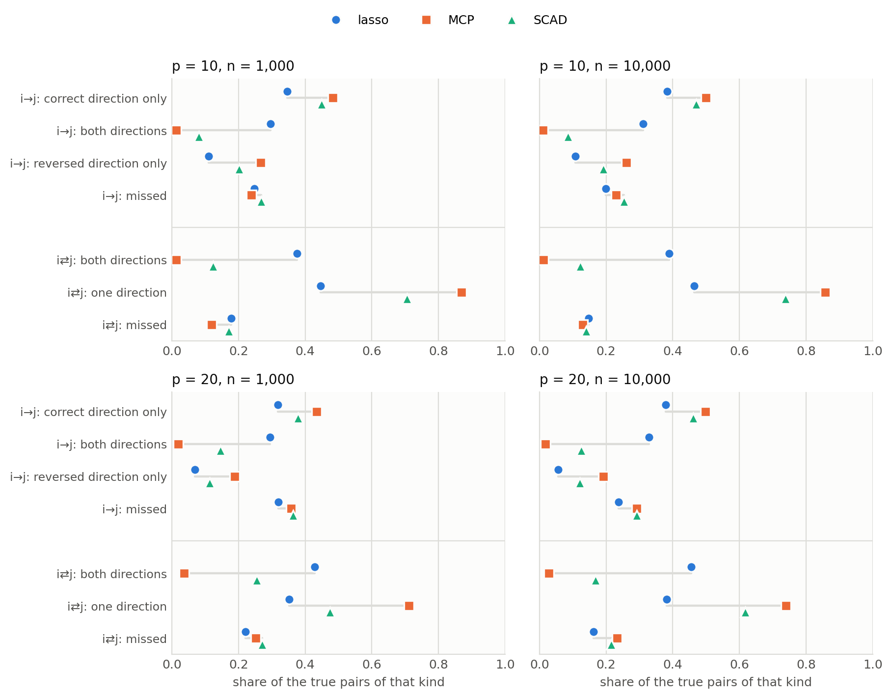
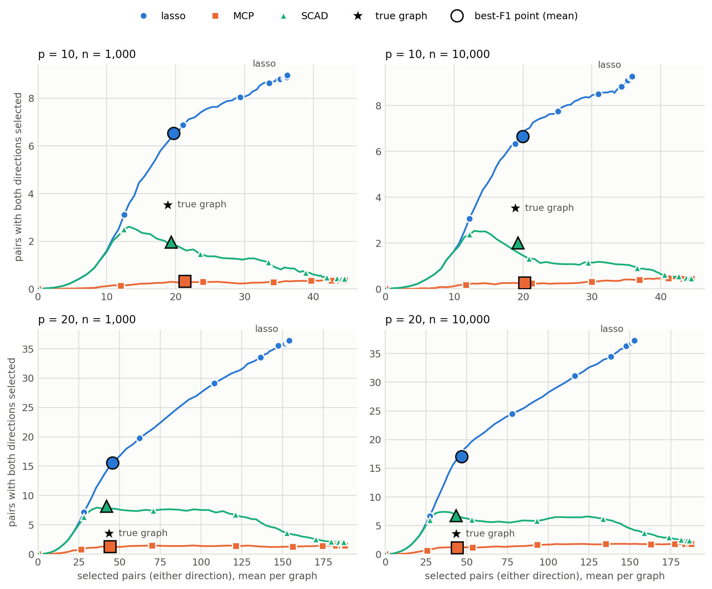
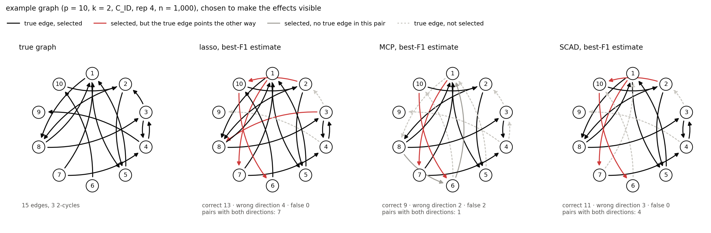

# S3a: does the lasso keep both directions of a pair, and MCP/SCAD only one?

*First part of the reversal-search study S3 (`plan.md`: score-based search). Before building a
search with reversal moves, this measures what the three penalties do with the two directions of a
pair, $M_{ij}$ and $M_{ji}$, on Dettling's Figure 5 graphs. Started 2 October 2026; the context is
in [`../next_steps/021026/next_steps_021026.md`](../next_steps/021026/next_steps_021026.md) §1–§4.*

**Status: complete (2 October 2026).** Runs, validation and figures are in §4, and the answers in §4.6.

---

## 1. Questions

1. Can the true drift matrix have bidirectional edges, i.e. 2-cycles $i \rightleftarrows j$ with
   $M^*_{ij} \neq 0 \neq M^*_{ji}$?
2. Do the nonconvex penalties ever select both directions of a pair?
3. Is it true that the lasso tends to keep both directions while MCP and SCAD keep one, and does
   that change from $n = 1000$ to $n = 10\,000$?

Notation: the edge $i \to j$ is the entry $M_{ji}$. For an unordered pair $\{i, j\}$, an estimate
selects *none*, *one direction* or *both directions*. A pair with both directions selected is
called *bidirectional* below.

## 2. What needs no simulation

**Question 1: yes, by construction.** `sample_drift` draws every off-diagonal entry independently,
$M^*_{ij} = \omega_{ij}\varepsilon_{ij}$ with $\omega_{ij} \sim \mathrm{Bernoulli}(d)$ and $d = k/p$.
Per unordered pair:

| | probability |
|---|---|
| no edge | $(1-d)^2$ |
| one direction | $2d(1-d)$ |
| 2-cycle (both directions) | $d^2$ |

So a fraction $d = k/p$ of all true edges sits in 2-cycles. The expected number of 2-cycles per
graph, $\binom p2 d^2 \approx k^2/2$, hardly depends on $p$:

| | $k=1$ | $k=2$ | $k=3$ | $k=4$ |
|---|---|---|---|---|
| $p=10$: true edges / 2-cycles / share of edges in 2-cycles | 9 / 0.45 / 10 % | 18 / 1.8 / 20 % | 27 / 4.05 / 30 % | 36 / 7.2 / 40 % |
| $p=20$: the same | 19 / 0.48 / 5 % | 38 / 1.9 / 10 % | 57 / 4.3 / 15 % | 76 / 7.6 / 20 % |

The run below also reports the observed numbers, as a check of the generator.

**Question 2 is a measurement.** There is no rule that stops MCP or SCAD from selecting both
directions. The mechanism of S2 §3.1 predicts it is rare: once one direction has $|M_{ij}| \ge
\gamma\lambda$, the other faces the full entry threshold $\lambda$, while the first has already
absorbed most of the signal the two share (their design columns correlate 0.6–0.8). The lasso keeps
shrinking the first entry, which leaves signal for the second. One more structural point: the path
saturates at $\operatorname{rank} A = p(p+1)/2$ entries. That is $p$ diagonal entries plus
$\binom p2$ off-diagonal ones, which is exactly one per pair on average.

## 3. Plan

| | |
|---|---|
| graphs | the Figure 5 generator and seeds of `run_s1_shard.py`: $k = 1..4$, all four $C$ choices, standardised input, $C = 2I$ in the fit |
| $p$ | 10, 20 |
| $n$ | 1000, 10 000. $M^*$ and $C$ do not depend on $n$, so the two sample sizes are paired graph by graph |
| reps | 10, i.e. 160 graphs per $(p, n)$, the same graphs as reps 0–9 of the S1 and S1b runs |
| penalties | lasso, MCP ($\gamma = 3$), SCAD ($\gamma = 3.7$), textbook convention; direct loss; continuation path of 100 $\lambda$ from $\lambda_{\max}$ to $10^{-4}\lambda_{\max}$, as in S1/S1b |
| stored per $\lambda$ | the selection pattern of every pair (none / $(i,j)$ only / $(j,i)$ only / both), the true pattern, $F_1$ |
| cost | about 10 CPU-h: 1 h 42 min on six laptop cores (p = 10 about 13 min, p = 20 about 39 min per sample size) |

**Quantities.** Each pair is classified by its truth (non-edge / single direction / 2-cycle) and by
what the estimate selects:

| truth \ estimate | none | one direction | both directions |
|---|---|---|---|
| single edge $i\to j$ | missed | correct, or reversed | **hedged** |
| 2-cycle | missed | half | **both** |
| non-edge | — | false pair | **false bidirectional** |

These are the categories of `gclm.metrics.orientation_breakdown`, here computed at every $\lambda$.
The analysis looks at them in three ways:

1. **At the best-F1 point** (oracle tuning, as `max_f1`): the share of true single edges that are
   correct / hedged / reversed / missed, and of true 2-cycles found in both / one / no direction.
2. **Along the path:** the number of bidirectional pairs against the number of selected pairs (the
   skeleton size). Comparing at the same skeleton size avoids that MCP is simply sparser at the
   same $\lambda$.
3. **Which direction enters first:** for every true single edge, does the true direction, the
   reversed one or both at once enter first, going from $\lambda_{\max}$ downwards, and is that
   first direction still the only one at the best-F1 point? This tests the mechanism of S2 §3.1
   directly ("the first direction to enter is frozen") and is the quantity a reversal move has to
   correct.

**Validation.** At $n = 1000$ the refits are the datasets of the stored S1 (lasso) and S1b (MCP,
SCAD) runs. Their best-F1 estimates must have exactly the same pair patterns. The refit driver
checks this.

**Figures** (`runs/s3a_bidirectional/figures/`; every plotted number is also in a CSV next to it):

1. bidirectional pairs against selected pairs along the path, for each $(p, n)$, with the true
   graph as a reference point;
2. outcomes at the best-F1 point (single edges and 2-cycles) for each penalty, $p$ and $n$;
3. one example graph ($p = 10$) drawn as a network: the truth and the three best-F1 estimates.

**Files.**

| file | role |
|---|---|
| `simulations/diagnostics/bidirectional.py` | `run`: refits and stores the patterns (`runs/s3a_bidirectional/raw/`, not tracked); `summarize`: validation, tables, the CSVs |
| `simulations/diagnostics/plot_bidirectional.py` | the figures, from the CSVs |
| `tests/test_bidirectional.py` | first-entry and summary logic on hand-made paths |

---

## 4. Results

Runs: `runs/s3a_bidirectional/` (CSVs and figures tracked; the per-$\lambda$ patterns in `raw/` are
not). 160 graphs per $(p, n)$, 960 paths per penalty.

**Validation.** At $n = 1000$ all 320 graphs per penalty were refitted, and their best-F1 pair
patterns are identical to the stored estimates:
- the lasso: `runs/s1_dettling_reproduction`;
- MCP and SCAD: `runs/s1b_pilot_p10-20`.

0 differ. So everything below is computed on the same fits as S1 / S1b.

### 4.1 The true graphs contain 2-cycles (question 1)

Observed (`truth_check.csv`), against $k/p$ from §2:

| $p$ | $k$ | true edges | 2-cycles | share of edges in 2-cycles | $k/p$ |
|---|---|---|---|---|---|
| 10 | 1 / 2 / 3 / 4 | 9.3 / 17.8 / 27.3 / 35.3 | 0.5 / 2.2 / 4.1 / 7.3 | 11 / 25 / 30 / 41 % | 10 / 20 / 30 / 40 % |
| 20 | 1 / 2 / 3 / 4 | 17.7 / 37.7 / 55.6 / 77.6 | 0.5 / 1.4 / 3.9 / 8.4 | 5 / 8 / 14 / 22 % | 5 / 10 / 15 / 20 % |

On average a graph has about 3.5 true 2-cycles at either $p$.

### 4.2 At the best-F1 point (questions 2 and 3)



*Figure 2. What happens to the true single edges $i\to j$ and the true 2-cycles $i\rightleftarrows j$
at each method's best-F1 point. Shares are pooled over the 160 graphs (`best_f1_outcomes.csv`).*

| $p$, $n$ | | lasso | MCP | SCAD |
|---|---|---|---|---|
| 10, 1000 | pairs with both directions, per graph | **6.5** | **0.3** | 2.0 |
| | … made of: hedged single edges / true 2-cycles / false pairs | 4.6 / 1.3 / 0.7 | 0.2 / 0.04 / 0.07 | 1.2 / 0.4 / 0.3 |
| | graphs with at least one such pair | 98 % | 23 % | 80 % |
| | true 2-cycles with both directions: at best F1 / anywhere on the path | 38 % / 61 % | **1 % / 4 %** | 12 % / 38 % |
| | true single edges: correct / hedged / reversed / missed | 35 / 30 / 11 / 25 % | 48 / 1 / 27 / 24 % | 45 / 8 / 20 / 27 % |
| 10, 10 000 | pairs with both directions, per graph | 6.6 | 0.3 | 2.0 |
| | true 2-cycles with both directions: at best F1 / anywhere | 39 % / 61 % | 1 % / 4 % | 12 % / 36 % |
| | true single edges: correct / hedged / reversed / missed | 38 / 31 / 11 / 20 % | 50 / 1 / 26 / 23 % | 47 / 9 / 19 / 25 % |
| 20, 1000 | pairs with both directions, per graph | **15.6** | **1.3** | 8.2 |
| | … made of: hedged / true 2-cycles / false pairs | 11.8 / 1.5 / 2.3 | 0.8 / 0.1 / 0.4 | 5.8 / 0.9 / 1.4 |
| | graphs with at least one such pair | 100 % | 67 % | 99 % |
| | true 2-cycles with both directions: at best F1 / anywhere | 43 % / 70 % | **4 % / 9 %** | 26 % / 50 % |
| | true single edges: correct / hedged / reversed / missed | 32 / 29 / 7 / 32 % | 43 / 2 / 19 / 36 % | 38 / 15 / 11 / 36 % |
| 20, 10 000 | pairs with both directions, per graph | 17.1 | 1.1 | 6.7 |
| | true 2-cycles with both directions: at best F1 / anywhere | 46 % / 66 % | 3 % / 8 % | 17 % / 47 % |
| | true single edges: correct / hedged / reversed / missed | 38 / 33 / 6 / 24 % | 50 / 2 / 19 / 29 % | 46 / 13 / 12 / 29 % |

`max_f1` for comparison: lasso / MCP / SCAD = 0.580 / 0.486 / 0.526 ($p=10$, $n=1000$), 0.622 / 0.513 /
0.555 ($n = 10^4$); 0.538 / 0.455 / 0.509 ($p = 20$, $n = 1000$), 0.605 / 0.512 / 0.561 ($n = 10^4$).

### 4.3 Along the path



*Figure 1. Pairs with both directions selected, against selected pairs, along the path (means over
the 160 graphs at each of the 100 $\lambda$'s, `path_means.csv`). Large markers are the mean
best-F1 point; the star is the true graph.*

- **The lasso** adds bidirectional pairs all the way down the path. It reaches 9 of its 36 selected
  pairs at $p = 10$ and 37 of 153 at $p = 20$ at the dense end. At its best-F1 point it already has
  about twice ($p = 10$) to five times ($p = 20$) as many as the true graph has 2-cycles.
- **MCP** stays near zero throughout. At the dense end it fills 44.5 of the 45 pairs ($p = 10$) and
  188 of 190 ($p = 20$), each with one direction. The path saturates at $\binom p2$ off-diagonal
  entries (§2), and MCP spends them as one direction per pair, while the lasso puts both directions
  into some pairs and leaves others empty.
- **SCAD** follows the lasso at first, peaks early (2.6 at $p = 10$, 8 at $p = 20$) and then loses
  bidirectional pairs as $\lambda$ decreases. Its refund zone $[\lambda, \gamma\lambda]$ lets the
  second direction in, and the flat part beyond it pushes it out again.

### 4.4 Which direction enters first, and what is left of it

For every true single edge: which direction enters first, going from $\lambda_{\max}$ down
(`first_entry.csv`), and what the best-F1 estimate holds for that pair:

| $p$, $n$ | | lasso | MCP | SCAD |
|---|---|---|---|---|
| 10, 1000 | true direction enters first / reversed one first | 51 / 39 % | 54 / 46 % | 54 / 44 % |
| | reversed first → still reversed only at best F1 | **22 %** | **50 %** | 35 % |
| | reversed first → true direction present at best F1 | **55 %** | **18 %** | 32 % |
| 10, 10 000 | true first / reversed first | 52 / 40 % | 54 / 45 % | 54 / 44 % |
| | reversed first → still reversed only / true direction present | 22 / 59 % | 50 / 19 % | 33 / 36 % |
| 20, 1000 | true first / reversed first | 58 / 36 % | 58 / 41 % | 58 / 39 % |
| | reversed first → still reversed only / true direction present | 18 / 48 % | 40 / 17 % | 24 / 32 % |
| 20, 10 000 | true first / reversed first | 61 / 34 % | 60 / 39 % | 60 / 37 % |
| | reversed first → still reversed only / true direction present | 15 / 59 % | 43 / 20 % | 26 / 36 % |

The rows do not add to 100 %. Some pairs enter in both directions at once (about 2 % for the lasso
and SCAD) or never enter (lasso up to 8 %). Some first-reversed pairs are missed at the best-F1
point, because their best $\lambda$ lies above their entry $\lambda$.

### 4.5 One example



*Figure 3. One $p = 10$ graph ($k = 2$, `C_ID`, rep 4, $n = 1000$; 15 edges, 3 2-cycles) and the three
best-F1 estimates. The graph was chosen by a fixed rule (`write_example` in `bidirectional.py`) to
make the effects visible; it is not a typical case.*

- **The lasso** keeps both directions in 7 pairs: all three true 2-cycles (1⇄5, 1⇄8, 3⇄4) and
  four hedges on single edges. Its four wrong-direction arrows (red) are exactly the second halves
  of those hedges.
- **MCP** keeps one direction of each of the three 2-cycles. Its only pair with both directions,
  1–7, is a hedge on a single edge. Of its two wrong-direction arrows, one is that hedge's second
  half and one a lone reversal.
- **SCAD** keeps both directions of all three 2-cycles plus one hedge.

### 4.6 Answers

1. **Yes, the true drift matrix has bidirectional edges.** Dettling's generator draws the two
   directions independently, so a fraction $k/p$ of the true edges sits in 2-cycles: 11–41 % at
   $p = 10$ and 5–22 % at $p = 20$, about 3.5 2-cycles per graph.
2. **The nonconvex penalties hardly produce bidirectional pairs.**
   - **MCP:** about 0.3 pairs per graph at $p = 10$ and 1.1–1.3 at $p = 20$ at the best-F1 point.
     It recovers both directions of 1–4 % of the true 2-cycles, and even anywhere along the whole
     path at most 9 %. In practice MCP is a one-direction-per-pair estimator.
   - **SCAD** is in between: 2 and 7–8 pairs per graph, and 12–26 % of the 2-cycles.
3. **Yes, the lasso keeps both directions.**
   - At its best-F1 point: 6.5 pairs per graph ($p = 10$) and 16–17 ($p = 20$).
   - About three quarters of these are hedges on true single edges. 1.3–1.6 per graph are real
     2-cycles, which is 38–46 % of all true 2-cycles. The few others are false pairs.
   - **Going from $n = 1000$ to $10^4$ changes almost nothing**, for any penalty. The pattern is a
     property of the penalties, not of sampling noise.
4. **The mechanism of S2 §3.1 holds on the full path.**
   - **The first direction to enter is close to a coin flip.** It is the true one for 51–61 % of
     edges, and about equally often for every penalty.
   - **What differs is what happens next.** When the wrong direction entered first, the lasso has
     the true direction back by its best-F1 point in 48–59 % of cases, usually as a hedge. MCP
     manages that in 17–20 % and keeps the wrong direction alone in 40–50 %.

### 4.7 What this means for the reversal search (S3)

- **The lasso's hedges are a ready-made candidate set.** In a bidirectional pair the true
  direction is present by construction, so the open decision is which direction to keep, or both
  for a 2-cycle. A search that starts from the lasso has to *decide* orientations; it rarely has to
  *find* them.
- **MCP's locked-in reversals** (19–27 % of the true single edges at the best-F1 point) are what a
  reversal move started from MCP has to undo.
- **2-cycles need their own move.** A one-direction-per-pair estimator cannot represent them. The
  search needs a move that adds the reverse of a selected edge, not only one that swaps it.
- **The stored patterns are ready for S3.** `raw/` holds every estimate's pattern along every path,
  so both starting points (lasso, MCP) are available on the same 640 graphs.

The follow-up is planned in [`S3b_reversal_search.md`](S3b_reversal_search.md).

Caveats:
- Oracle tuning: the best-F1 point is chosen with knowledge of the truth.
- 10 reps, i.e. 160 graphs per $(p, n)$; the effects are large compared with that.
- Only $n = 10^4$ as the larger sample size; the cluster sweep adds $10^5$ and $\infty$.

---

## 5. Reproducing

```bash
python simulations/diagnostics/bidirectional.py run --p 10 20 --n 1000 10000 --reps 10 --workers 6
python simulations/diagnostics/bidirectional.py summarize
python simulations/diagnostics/plot_bidirectional.py
```
